# Drone-optimal-trajectory

This repository contains a ROS2 + PX4 SITL + Gazebo stack for a quadrotor MPC with LiDAR-based obstacle avoidance. The MPC runs inside ROS2, consumes PX4 odometry and LaserScan data, and outputs trajectory setpoints with velocity feedforward.

## Contents

### MPC v2 (Recommended)
- `drone_ws/src/drone/drone/mpc_core.py` - Clean CasADi MPC solver with obstacle-aware reference trajectory
- `drone_ws/src/drone/drone/mpc_obstacle_avoidance_node_v2.py` - ROS2 node with direct PX4 control and velocity feedforward
- `drone_ws/src/drone/drone/mpc_visualizer.py` - Real-time 3D visualization tool
- `drone_ws/src/drone/launch/mpc_obstacle_avoidance_v2.launch.py` - Standalone launch file (no separate commander needed)

### Legacy MPC v1
- `drone_ws/src/drone/drone/mpc_obstalce_avoidance_node.py` - Original ROS2 node (requires separate commander)
- `drone_ws/src/drone/drone/mpc_solver.py` - Original CasADi MPC formulation
- `drone_ws/src/drone/drone/mpc_mission_commander.py` - Offboard commander that tracks MPC trajectory
- `drone_ws/src/drone/drone/hover_enable_commander.py` - Hover gate that enables MPC once altitude is stable

### Utilities
- `drone_ws/scripts/plot_topics.py` and `drone_ws/scripts/plot_csv.py` - Plotters for rosbag and CSV data

---

## MPC v2 Overview (Recommended)

The MPC v2 is a complete rewrite addressing issues found in v1. Key improvements:

| Feature | v1 | v2 |
|---------|----|----|
| PX4 Control | Via separate commander node | **Direct TrajectorySetpoint** |
| Velocity | Position-only commands | **Velocity feedforward** |
| Obstacle Constraints | Half-space constraints (can fail) | **Distance-based soft constraints** |
| Reference Trajectory | Straight line or reference built from the current drone position | **Potential field obstacle-aware** |
| Architecture | Multiple nodes | **Single self-contained node** |
| Speed | Slow (~0.1 m/s) | **Fast (~2-3 m/s)** |

### Architecture

```mermaid
flowchart TB
    subgraph node["mpc_obstacle_avoidance_node_v2"]
        direction TB
        
        subgraph processing["Processing Pipeline"]
            direction LR
            LP["🔍 LidarProcessor<br/><i>clustering</i>"]
            GN["🧭 GapNavigator<br/><i>path planning</i>"]
            MPC["⚡ MPCSolver<br/><i>optimization</i>"]
            LP --> GN --> MPC
        end
        
        subgraph px4ctrl["Direct PX4 Control Interface"]
            TS["📍 TrajectorySetpoint<br/>position + velocity + yaw"]
            OCM["🎮 OffboardControlMode<br/>at 10Hz"]
            VC["🚁 VehicleCommand<br/>arm, offboard mode"]
        end
        
        processing --> px4ctrl
    end
    
    subgraph px4["PX4 SITL"]
        CTRL["Flight Controller"]
    end
    
    subgraph sensors["Sensors"]
        ODOM["/fmu/out/vehicle_odometry"]
        SCAN["/scan - LiDAR"]
    end
    
    node -->|"/fmu/in/trajectory_setpoint"| px4
    px4 --> ODOM
    ODOM -->|"Position, Velocity, Orientation"| node
    SCAN -->|"LaserScan"| node

    style node fill:#e1f5fe,stroke:#01579b
    style px4 fill:#fff3e0,stroke:#e65100
    style processing fill:#f3e5f5,stroke:#7b1fa2
    style px4ctrl fill:#e8f5e9,stroke:#2e7d32
```



### State and Input

The MPC uses an 8-state double-integrator model:

$$
x_k = [p_x, p_y, p_z, \psi, v_x, v_y, v_z, \dot{\psi}]^T
$$

$$
u_k = [a_x, a_y, a_z, \ddot{\psi}]^T
$$

### Discrete-Time Dynamics

$$
p_{k+1} = p_k + \Delta t \cdot v_k + \frac{\Delta t^2}{2} \cdot a_k
$$

$$
v_{k+1} = v_k + \Delta t \cdot a_k
$$

$$
\psi_{k+1} = \psi_k + \Delta t \cdot \dot{\psi}_k
$$

$$
\dot{\psi}_{k+1} = \dot{\psi}_k + \Delta t \cdot \ddot{\psi}_k
$$

### Obstacle-Aware Reference Trajectory

Unlike v1's straight-line reference, v2 uses a **potential field** approach to generate obstacle-aware references [1, 2]:

$$
p^{ref}_{k+1} = p^{ref}_k + \Delta t \cdot v_{desired} \cdot \hat{d}_{attractive} + \sum_i F_{repulsive,i}
$$

Where:
- $\hat{d}_{attractive}$ = unit vector toward goal (attractive potential gradient)
- $F_{repulsive,i}$ = repulsive force from obstacle $i$:

$$
F_{repulsive,i} = \begin{cases}
\eta \cdot \left(\frac{1}{d_i} - \frac{1}{d_0}\right) \cdot \frac{1}{d_i^2} \cdot \hat{n}_i & \text{if } d_i < d_0 \\
0 & \text{otherwise}
\end{cases}
$$

Where $d_0$ is the influence distance and $\eta$ is the repulsion gain.

> **References:**
> 1. E. Rimon and D. E. Koditschek, *"Exact Robot Navigation Using Artificial Potential Functions"*, IEEE Transactions on Robotics and Automation, vol. 8, no. 5, pp. 501-518, 1992. [[DOI]](https://doi.org/10.1109/70.163777)
> 2. S. S. Ge and Y. J. Cui, *"Dynamic Motion Planning for Mobile Robots Using Potential Field Method"*, Autonomous Robots, vol. 13, pp. 207-222, 2002. [[DOI]](https://doi.org/10.1023/A:1020564024509)

### Cost Function

$$
J = \sum_{k=0}^{N-1} \Big[
Q_p \lVert p_k - p_k^{ref} \rVert^2 + 
Q_g \lVert p_k - p_{goal} \rVert^2 + 
Q_v \lVert v_k \rVert^2 + 
Q_\psi (\psi_k - \psi_k^{ref})^2 +
R_a \lVert a_k \rVert^2 + 
R_{\ddot{\psi}} \ddot{\psi}_k^2 +
\rho \sum_j s_{j,k}^2
\Big] + J_{terminal}
$$

### Distance-Based Obstacle Constraints (Soft)

Instead of half-space constraints, v2 uses **distance-based soft constraints**:

$$
d_{ij} - r_s + s_{ij} \geq 0, \quad s_{ij} \geq 0
$$

Where:
- $d_{ij}$ = Euclidean distance from predicted position $p_k$ to obstacle $j$
- $r_s$ = safety radius (default 1.2m)
- $s_{ij}$ = slack variable (penalized heavily in cost)

This formulation:
- Never causes infeasibility (slack allows violation with high cost)
- Works in all directions (not just normal direction)
- Handles moving closer to obstacles gracefully

### Velocity Feedforward to PX4

The key to fast response is **velocity feedforward**. The TrajectorySetpoint includes both position and velocity:

```python
traj_msg.position = [x, y, z]      # Where to go
traj_msg.velocity = [vx, vy, vz]  # How fast to go (from MPC!)
traj_msg.yaw = yaw
traj_msg.yawspeed = yaw_rate
```

This tells PX4's controller the intended velocity, so it doesn't have to "guess" and ramp up slowly.

### Gap-Based Navigation (Optional)

For complex environments like narrow corridors, v2 includes optional gap-based navigation (same algorithm as v1). Enable with:

```bash
ros2 launch drone mpc_obstacle_avoidance_v2.launch.py gap_navigation_enabled:=true
```

### MPC v2 Parameters

#### Core MPC Parameters

| Parameter | Default | Description |
|-----------|---------|-------------|
| `dt` | `0.1` | Time step [s] |
| `horizon` | `20` | Prediction horizon steps |
| `safety_radius` | `1.2` | Min distance from obstacles [m] |
| `emergency_radius` | `0.6` | Emergency brake distance [m] |
| `max_velocity` | `3.0` | Max velocity [m/s] |
| `max_acceleration` | `4.0` | Max acceleration [m/s²] |
| `max_yaw_rate` | `1.5` | Max yaw rate [rad/s] |

#### Cost Weight Parameters (Speed Tuning)

| Parameter | Default | Effect |
|-----------|---------|--------|
| `Q_pos` | `50.0` | Position tracking (higher = follows reference tighter) |
| `Q_vel` | `0.5` | Velocity penalty (lower = faster) |
| `R_acc` | `0.05` | Acceleration penalty (lower = more aggressive) |
| `Q_terminal` | `200.0` | Terminal cost (higher = reaches goal more precisely) |

#### PX4 Control Parameters

| Parameter | Default | Description |
|-----------|---------|-------------|
| `direct_px4_control` | `true` | Send commands directly to PX4 |
| `velocity_feedforward` | `true` | Include velocity in setpoint |
| `lookahead_index` | `5` | Trajectory index for position setpoint |
| `auto_arm` | `true` | Automatically arm and switch to offboard |

### Running MPC v2

```bash
# Build
cd ~/Drone-optimal-trajectory/drone_ws
colcon build --packages-select drone
source install/setup.bash

# Run (single command - no separate commander needed!)
ros2 launch drone mpc_obstacle_avoidance_v2.launch.py goal:='[10.0, 10.0, 1.5]'

# With custom parameters
ros2 launch drone mpc_obstacle_avoidance_v2.launch.py \
    goal:='[10.0, 10.0, 1.5]' \
    max_velocity:=4.0 \
    safety_radius:=1.5 \
    R_acc:=0.02

# Run 3D visualizer (in separate terminal)
ros2 run drone mpc_visualizer
```

### Tuning Guide

**Drone too slow?**
- Decrease `R_acc` (e.g., 0.02)
- Decrease `Q_vel` (e.g., 0.1)
- Increase `max_velocity` (e.g., 4.0)
- Increase `max_acceleration` (e.g., 5.0)

**Drone hits obstacles?**
- Increase `safety_radius` (e.g., 1.5)
- Increase `emergency_radius` (e.g., 0.8)
- Decrease `max_velocity` (e.g., 2.0)

**Drone oscillates near obstacles?**
- Increase `Q_pos` for tighter reference tracking
- Enable gap navigation for complex environments

---

## MPC v1 Overview (Legacy)

### State and input
The solver in `mpc_solver.py` uses:

$$
x_k = [p_x, p_y, p_z, \psi, v_x, v_y, v_z, r]^T
$$
$$
u_k = [a_x, a_y, a_z, \dot{r}]^T
$$

with yaw rate $r = \dot{\psi}$.

### Discrete-time dynamics

$$
p_{k+1} = p_k + \Delta t \, v_k
$$
$$
\psi_{k+1} = \psi_k + \Delta t \, r_k
$$
$$
v_{k+1} = v_k + \Delta t \, a_k
$$
$$
r_{k+1} = r_k + \Delta t \, \dot{r}_k
$$

### Reference generation
`mpc_obstalce_avoidance_node.py` builds a reference trajectory in ENU by:
- Reusing the previous MPC solution if it is still close to the current state.
- Otherwise, generating a straight-line segment to the current goal at a constant desired speed.

Yaw reference is aligned with the line from the current position to the goal.

### Obstacle half-spaces
For each step, the solver builds half-space constraints from LiDAR points:

$$
n_i^T p_k \ge n_i^T z_i + r_s - s_{i,k}
$$

where $z_i$ are obstacle points, $n_i$ is the unit normal pointing from the obstacle to the reference position, $r_s$ is the safety radius, and $s_{i,k} \ge 0$ are slack variables. Only the nearest points (up to `m_planes`) within a range are used to build the half-spaces.

### Gap-based navigation

The MPC uses a two-layer approach for obstacle avoidance. While the half-space constraints handle low-level collision avoidance, a **gap-based navigation** layer provides high-level path planning through cluttered environments. This is essential for handling non-convex obstacle configurations (e.g., a cylinder blocking the direct path where the drone must choose to go left or right).

#### Gap detection algorithm

The gap detection analyzes the LiDAR scan to find free corridors:

1. **Identify free directions**: A scan ray is marked as "free" if:
   - Range exceeds 90% of `max_obs_range` (no obstacle detected)
   - Range is invalid/infinite (clear path)
   - Range is below minimum threshold (sensor noise)

2. **Group consecutive free rays into gaps**: The algorithm sweeps through the scan and groups consecutive free directions. Each gap is characterized by:
   - Start/end angles (angular extent)
   - Center angle (middle direction)
   - Minimum range (depth of the gap)
   - Angular width

3. **Filter by minimum width**: Gaps narrower than `gap_min_width` (default 1.0m at max range) are discarded.

4. **Handle wrap-around**: If a gap spans the scan boundaries (e.g., -π to +π), the algorithm merges the first and last gaps.

#### Gap selection and scoring

When the direct path to the goal is blocked, the algorithm scores each gap:

$$
\text{score} = w_{align} \cdot \text{alignment} + (1 - w_{align}) \cdot \text{quality}
$$

where:
- **Alignment** (0 to 1): How well the gap center points toward the goal direction
  $$\text{alignment} = \frac{\pi - |\theta_{gap} - \theta_{goal}|}{\pi}$$
- **Quality**: Combined measure of gap width and depth
  $$\text{quality} = \frac{w_{gap}}{\pi} \cdot \frac{r_{min}}{r_{max}}$$
- $w_{align}$ is `gap_alignment_weight` (default 0.85, strongly preferring goal direction)

Additional scoring modifiers:
- Gaps >90° off goal direction: 80% penalty
- Gaps >60° off goal direction: 50% penalty  
- Gaps <30° off goal direction: 30% bonus

#### Intermediate goal placement

Once the best gap is selected, an intermediate goal is placed through it:

$$
p_{intermediate} = p_{drone} + d \cdot \hat{n}_{gap}
$$

where $d = \min(d_{gap}, 0.8 \cdot r_{min}, d_{goal})$ and $\hat{n}_{gap}$ is the unit direction toward the gap center in world frame. Here $d_{gap}$ is `gap_goal_distance`, $r_{min}$ is the minimum range in the gap, and $d_{goal}$ is the distance to goal.

#### Stability mechanisms

To prevent oscillation between gaps:
- **Hysteresis**: The intermediate goal only changes if the new position differs by more than `gap_hysteresis` (default 1.0m)
- **Spin detection**: If the drone is rotating fast (>0.3 rad/s) but moving slow (<0.5 m/s), the intermediate goal is locked
- **Direct path check**: A cone of ±17° around the goal direction is checked; if clear beyond `direct_path_threshold`, gap navigation is bypassed

#### Parameters

| Parameter | Default | Description |
|-----------|---------|-------------|
| `gap_nav_enabled` | `true` | Enable/disable gap-based navigation |
| `gap_min_width` | `1.0` | Minimum gap width in meters |
| `gap_goal_distance` | `3.0` | Distance to place intermediate goal |
| `gap_alignment_weight` | `0.85` | Weight for goal alignment vs gap quality |
| `direct_path_threshold` | `3.0` | Min clear distance to use direct path |
| `gap_hysteresis` | `1.0` | Min change in goal to switch gaps |

### Cost function

$$
J = \sum_{k=0}^{N-1} \Big(
Q_p^{ref} \lVert p_k - p_k^{ref} \rVert^2 + Q_p^{goal} \lVert p_k - p_{goal} \rVert^2 + Q_\psi \lVert \psi_k - \psi_k^{ref} \rVert^2 + Q_v \lVert v_k \rVert^2 + Q_r \lVert r_k \rVert^2 + R_a \lVert a_k \rVert^2 + R_{\dot{r}} \lVert \dot{r}_k \rVert^2 + \rho \lVert s_k \rVert^2 \Big) + J_{terminal}
$$

The terminal cost applies additional weight to the final position and yaw error.

### Constraints
- Dynamics equality constraints for each step.
- Altitude bounds: $z_{min} \le z_k \le z_{max}$ (including terminal).
- Velocity and yaw rate bounds.
- Acceleration and yaw acceleration bounds.
- Obstacle half-space constraints with non-negative slack.

### Solver
The MPC is solved with CasADi + IPOPT. Decision variables are bounded explicitly (state, input, and slack), and a warm start is initialized from the reference trajectory.

---

## How to Run

### Prerequisites

1. Docker environment set up (see docker/ directory)
2. PX4 SITL + Gazebo running
3. Micro-XRCE-DDS-Agent running
4. ROS2 Humble workspace built

### Quick Start (MPC v2 - Recommended)

```bash
# Allow GUI forwarding from containers (on host)
xhost +

cd /path/to/Drone-optimal-trajectory/docker/PX4-dev-env/full_docker_setup

# Build and start the docker-compose service
docker-compose build
docker-compose up -d

# On the host (not in the container), open QGC in a new terminal
cd /path/to/Drone-optimal-trajectory/QGC
./QGroundControl-x86_64.AppImage

# Enter the px4 container in a new terminal
docker-compose exec px4-stack bash

# Inside the container, start the 2D lidar drone simulation with walls
make px4_sitl gz_x500_lidar_2d_walls

# (or for simple environment without obstacles)
make px4_sitl gz_x500_lidar_2d

# In another container terminal, run the micro-ROS agent
cd /Micro-XRCE-DDS-Agent/build
MicroXRCEAgent udp4 -p 8888

# In another container terminal, launch RViz2 with the laser scan bridge
cd /workspace/
source /opt/ros/humble/setup.bash
source install/setup.bash
ros2 launch drone laser_bridge.launch.py

# In another container terminal, run MPC v2 (RECOMMENDED)
cd /workspace/
source /opt/ros/humble/setup.bash
source install/setup.bash
ros2 launch drone mpc_obstacle_avoidance_v2.launch.py goal:='[10.0, 10.0, 1.5]'

# (Optional) In another terminal, run the 3D visualizer
ros2 run drone mpc_visualizer
```

### Running MPC v1 (Legacy)

If you need to use the legacy MPC v1 system:

```bash
# In a container terminal, run the MPC v1 planner + hover gate + commander
cd /workspace/
source /opt/ros/humble/setup.bash
source install/setup.bash
ros2 launch drone path_planning.launch.py
```

The `path_planning.launch.py` launch file starts:
- `hover_enable_commander` (arms, holds hover, then publishes `/mpc/enable`)
- `mpc_obstacle_avoidance` (waits for enable, then optimizes)
- `mpc_mission_commander` (waits for enable, then tracks the MPC path)

### RViz2 Setup

Once you launch the laser_bridge:
1. Set the fixed frame to `world`
2. Add `LaserScan` display subscribing to `/scan`
3. Add `Path` displays for `/mpc/predicted_path` and `/mpc/reference_path`
4. Add `PoseStamped` for `/mpc/active_goal` and `/mpc/final_goal`

---

## Plotting Results (rosbag + CSV)

To generate the csv files from rosbag data, run the following script:

```bash
cd /workspace/scripts
./plot_topics.py  --backend csv --out ./plot_data
```

To plot from CSV data:

```bash
cd /workspace/scripts
./plot_csv.py --dir ./plot_data
```

---

## Troubleshooting

### Drone moves too slowly
- Decrease `R_acc` parameter (e.g., `R_acc:=0.02`)
- Ensure `velocity_feedforward:=true` is set
- Increase `max_velocity` (e.g., `max_velocity:=4.0`)

### Drone hits obstacles
- Increase `safety_radius` (e.g., `safety_radius:=1.5`)
- Decrease `max_velocity` for more reaction time
- Check that LiDAR is publishing on `/scan`

### MPC solver fails
- Check obstacle count in logs (should be <30 after clustering)
- Increase `max_obstacle_range` if needed
- Check for invalid odometry data

### Drone doesn't arm
- Ensure QGroundControl is connected
- Check that `auto_arm:=true` is set
- Verify offboard control mode messages are being sent
