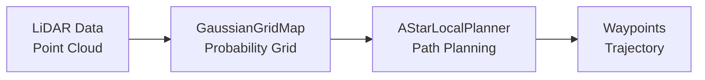
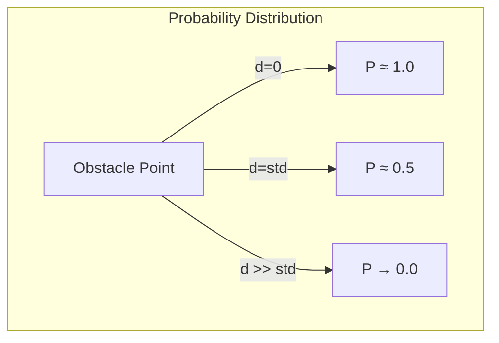
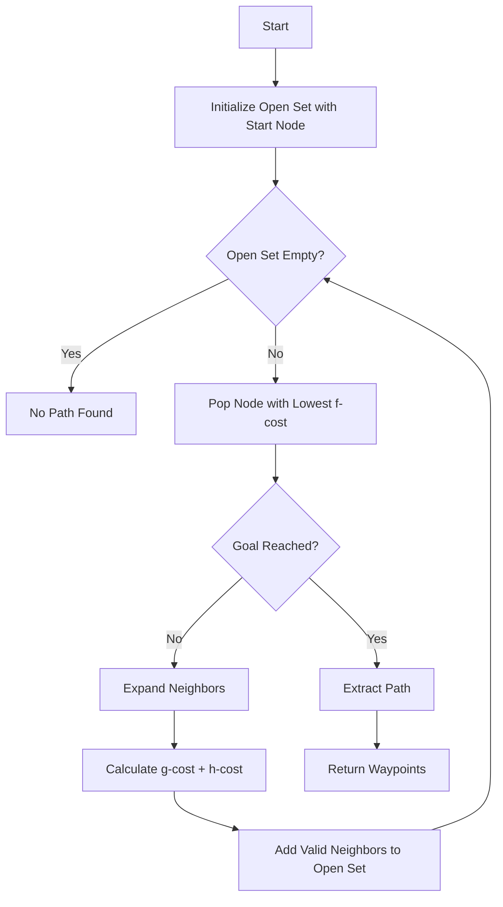
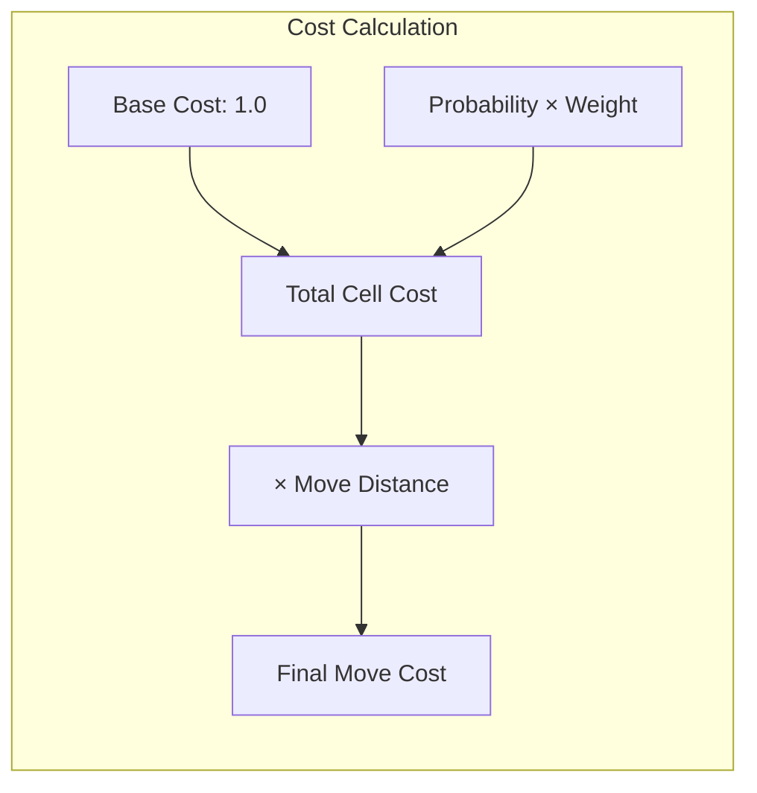
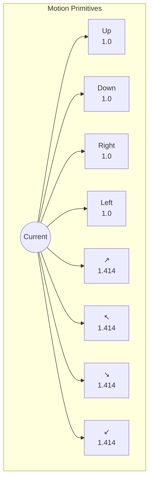
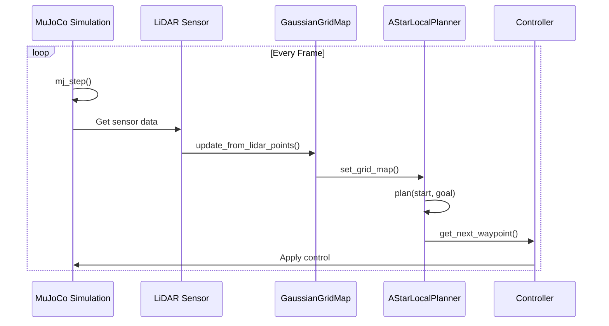
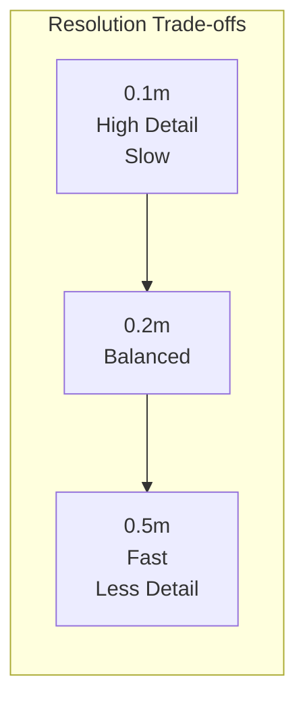
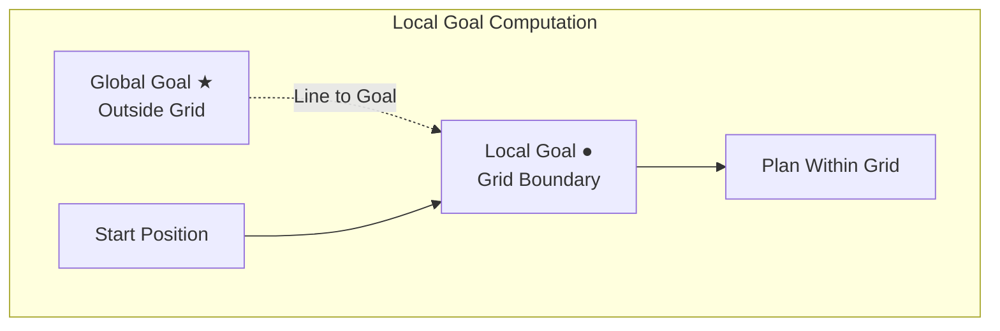
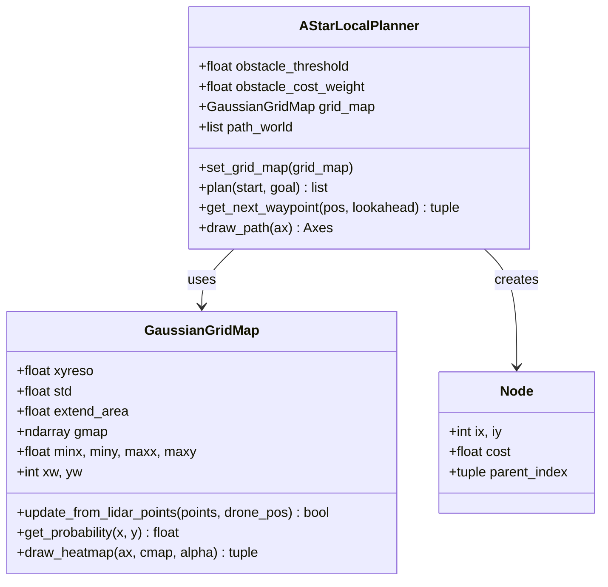
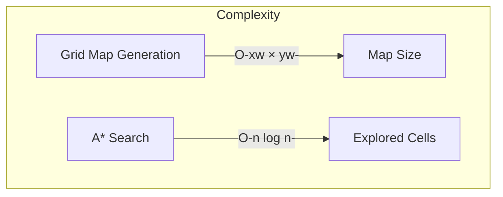

# A* Local Planner Documentation

## Overview

The A* Local Planner is a path planning module designed for drone navigation in environments with obstacles detected via LiDAR. It uses a **Gaussian Grid Map** to represent obstacle probabilities and plans optimal paths that balance distance minimization with obstacle avoidance.

## Architecture



### Components

| Component | File | Purpose |
|-----------|------|---------|
| `GaussianGridMap` | `gaussian_grid_map.py` | Converts LiDAR points to probabilistic occupancy grid |
| `AStarLocalPlanner` | `A_star_planner.py` | Plans paths using A* algorithm on the probability grid |

## Gaussian Grid Map

### Probability Calculation

For each grid cell, the obstacle probability is computed using the **Gaussian Cumulative Distribution Function (CDF)**:

$$P(\text{obstacle}) = 1 - \text{CDF}(d_{\min}, \mu=0, \sigma=\text{std})$$

Where:
- $d_{\min}$ = minimum distance from cell center to any detected obstacle point
- $\text{std}$ = standard deviation parameter (controls probability spread)



### Grid Configuration

```python
GaussianGridMap(
    xyreso=0.2,      # Grid resolution in meters
    std=0.5,         # Gaussian standard deviation
    extend_area=2.0  # Extension around obstacles
)
```

## A* Local Planner

### Algorithm



The planner implements the **A* search algorithm** with the evaluation function:

$$f(n) = g(n) + h(n)$$

Where:
- $g(n)$ = cost from start to node $n$
- $h(n)$ = heuristic estimate (Euclidean distance to goal)

### Cost Function

The traversal cost for moving to a cell incorporates obstacle probability:

$$\text{J_{cell}} = 1.0 + w \times P(\text{obstacle})$$

$$\text{J_{move}} = \text{d} \times \text{J_{cell}}$$

Where $w$ = `obstacle_cost_weight` and $d$ = `distance` 



### Motion Model

8-directional movement with appropriate cost multipliers:



| Direction | dx | dy | Cost Multiplier |
|-----------|----|----|-----------------|
| Right | +1 | 0 | 1.0 |
| Up | 0 | +1 | 1.0 |
| Left | -1 | 0 | 1.0 |
| Down | 0 | -1 | 1.0 |
| Diagonal | ±1 | ±1 | √2 ≈ 1.414 |

## Usage

### Basic Usage

```python
from gaussian_grid_map import GaussianGridMap
from A_star_planner import AStarLocalPlanner

# 1. Create grid map from LiDAR points
grid_map = GaussianGridMap(xyreso=0.2, std=0.5, extend_area=2.0)
grid_map.update_from_lidar_points(lidar_points, drone_pos=current_pos)

# 2. Create planner
planner = AStarLocalPlanner(
    obstacle_threshold=0.5,    # Cells above this are blocked
    obstacle_cost_weight=10.0  # Penalty for high-probability cells
)
planner.set_grid_map(grid_map)

# 3. Plan path
start = (0.0, 0.0)
goal = (5.0, 5.0)
path = planner.plan(start, goal)

# 4. Get waypoints for trajectory tracking
next_waypoint = planner.get_next_waypoint(current_pos, lookahead_distance=0.5)
```

### Integration with MuJoCo Simulation



```python
import mujoco
from gaussian_grid_map import GaussianGridMap
from A_star_planner import AStarLocalPlanner

# Initialize
model = mujoco.MjModel.from_xml_path('drone_world.xml')
data = mujoco.MjData(model)

grid_map = GaussianGridMap(xyreso=0.2, std=0.5, extend_area=2.0)
planner = AStarLocalPlanner(obstacle_threshold=0.5, obstacle_cost_weight=10.0)

# Main loop
while running:
    mujoco.mj_step(model, data)

    # Get LiDAR points
    points = get_lidar_points(data)
    drone_pos = data.qpos[:3]

    # Update grid map
    grid_map.update_from_lidar_points(points, drone_pos=drone_pos)
    planner.set_grid_map(grid_map)

    # Replan path
    path = planner.plan(drone_pos[:2], goal)

    # Get next waypoint for controller
    waypoint = planner.get_next_waypoint(drone_pos[:2])
```

## API Reference

### AStarLocalPlanner

#### Constructor

```python
AStarLocalPlanner(obstacle_threshold=0.5, obstacle_cost_weight=10.0)
```

| Parameter | Type | Default | Description |
|-----------|------|---------|-------------|
| `obstacle_threshold` | float | 0.5 | Probability threshold for blocked cells |
| `obstacle_cost_weight` | float | 10.0 | Weight for probability in cost function |

#### Methods

| Method | Parameters | Returns | Description |
|--------|------------|---------|-------------|
| `set_grid_map(grid_map)` | `GaussianGridMap` | None | Set the grid map for planning |
| `plan(start, goal)` | `(x,y), (x,y)` | `List[(x,y)]` or `None` | Plan path from start to goal |
| `get_next_waypoint(pos, lookahead)` | `(x,y), float` | `(x,y)` or `None` | Get next waypoint for tracking |
| `draw_path(ax)` | `matplotlib.Axes` | `Axes` | Visualize planned path |
| `world_to_grid(x, y)` | `float, float` | `(ix, iy)` | Convert world to grid coords |
| `grid_to_world(ix, iy)` | `int, int` | `(x, y)` | Convert grid to world coords |

### GaussianGridMap

#### Constructor

```python
GaussianGridMap(xyreso=0.5, std=1.0, extend_area=2.0)
```

| Parameter | Type | Default | Description |
|-----------|------|---------|-------------|
| `xyreso` | float | 0.5 | Grid cell resolution in meters |
| `std` | float | 1.0 | Gaussian standard deviation |
| `extend_area` | float | 2.0 | Extension around detected obstacles |

#### Methods

| Method | Parameters | Returns | Description |
|--------|------------|---------|-------------|
| `update_from_lidar_points(points, drone_pos)` | `Nx3 array, (x,y,z)` | `bool` | Update map from LiDAR data |
| `get_probability(x, y)` | `float, float` | `float` or `None` | Query probability at position |
| `draw_heatmap(ax, cmap, alpha)` | `Axes, str, float` | `(Axes, pcolormesh)` | Visualize probability map |

## Parameter Tuning

### Grid Resolution (`xyreso`)



| Value | Effect | Use Case |
|-------|--------|----------|
| 0.1m | High detail, slow computation | Tight spaces, precise navigation |
| 0.2m | Good balance | General indoor/outdoor use |
| 0.5m | Fast computation, less detail | Large open areas |

### Gaussian Standard Deviation (`std`)

| Value | Effect |
|-------|--------|
| 0.2 | Sharp probability drop-off, tight obstacle boundaries |
| 0.5 | Moderate spread, good safety margin |
| 1.0 | Wide spread, very conservative paths |

### Obstacle Threshold

| Value | Effect |
|-------|--------|
| 0.3 | Conservative - blocks cells with lower probability |
| 0.5 | Balanced - standard threshold |
| 0.7 | Aggressive - allows closer proximity to obstacles |

### Obstacle Cost Weight

| Value | Effect |
|-------|--------|
| 5.0 | Mild avoidance, shorter paths |
| 10.0 | Balanced avoidance |
| 20.0 | Strong avoidance, longer but safer paths |

## Local Goal Handling

When the global goal is outside the local grid map bounds, the planner automatically computes a **local goal** at the grid boundary:



This allows the planner to make progress toward distant goals while only considering local obstacle information.

## Class Diagram



## Visualization

```python
import matplotlib.pyplot as plt

fig, ax = plt.subplots(figsize=(10, 8))

# Draw probability heatmap
grid_map.draw_heatmap(ax=ax, cmap='Reds', alpha=0.6)

# Draw planned path
planner.draw_path(ax=ax)

# Draw goal
ax.plot(goal[0], goal[1], 'm^', markersize=12, label='Goal')

ax.legend()
plt.show()
```

## Performance Considerations



1. **Grid Size**: Computation scales with $O(xw \times yw)$ for map generation
2. **A* Complexity**: Worst case $O(n \log n)$ where $n$ = number of cells
3. **Replanning Frequency**: Balance between responsiveness and computation load

### Optimization Tips

- Use larger `xyreso` for faster computation in open areas
- Limit `extend_area` to reduce grid size
- Replan only when significant changes detected in LiDAR data
- Consider hierarchical planning for long-distance goals

## Example Output

```
A* Local Planner Test
========================================
Grid size: 45 x 45
Grid bounds: x=[-4.0, 5.0], y=[-4.0, 5.0]

Planning from (0.0, 0.0) to (5.0, 5.0)...
Path found with 38 waypoints
```

## Dependencies

- `numpy` - Array operations
- `scipy` - Gaussian CDF computation
- `matplotlib` - Visualization (optional)
- `heapq` - Priority queue for A* search
