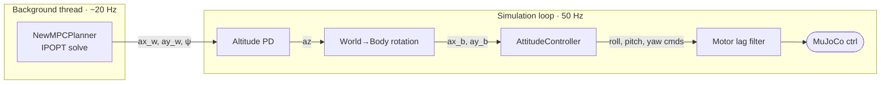
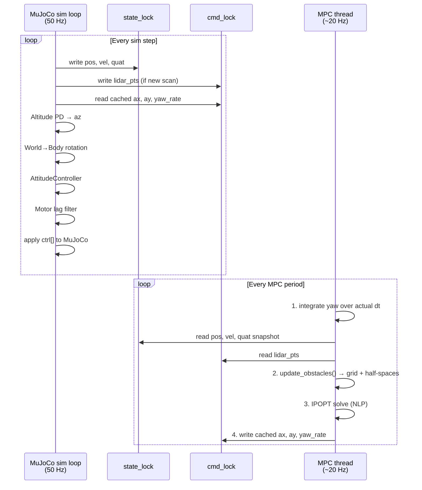
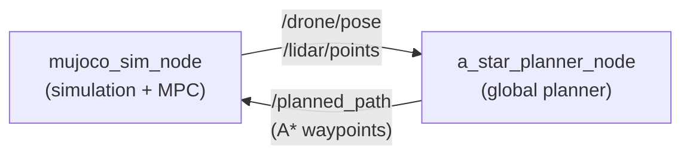
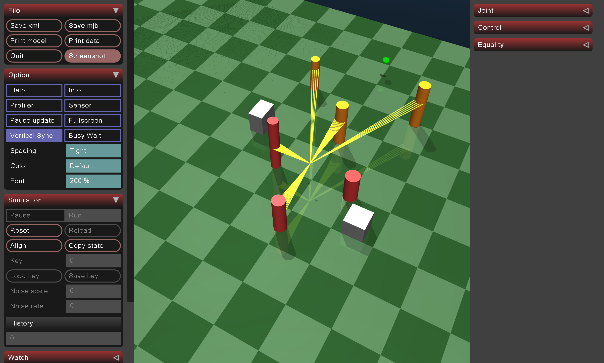

# MPC + A* Drone Navigation — Full System Documentation

**Project:** Drone Optimal Trajectory | MuJoCo Simulation
**Author:** Lorenzo Ortolani
**Branch:** `A_star_planner`

---

## Table of Contents

1. [System Overview](#1-system-overview)
2. [Gaussian Grid Map](#2-gaussian-grid-map)
3. [A* Path Planner](#3-a-path-planner)
4. [MPC Local Planner (`new_mpc.py`)](#4-mpc-local-planner-new_mpcpy)
   - 4.1 [State and Control Representation](#41-state-and-control-representation)
   - 4.2 [Discrete-Time Dynamics](#42-discrete-time-dynamics)
   - 4.3 [Reference Trajectory](#43-reference-trajectory)
   - 4.4 [Cost Function](#44-cost-function)
   - 4.5 [Constraints](#45-constraints)
   - 4.6 [Complete NLP Formulation](#46-complete-nlp-formulation)
   - 4.7 [Obstacle Avoidance: Half-Space Linearisation (SCA)](#47-obstacle-avoidance-half-space-linearisation-sca)
   - 4.8 [Terminal Path Constraint](#48-terminal-path-constraint)
   - 4.9 [Warm Starting](#49-warm-starting)
5. [Cascaded Drone Controller](#5-cascaded-drone-controller)
6. [End-to-End Data Flow](#6-end-to-end-data-flow)
7. [Running the ROS 2 Launch Files](#7-running-the-ros-2-launch-files)
8. [Results and Visualisations](#8-results-and-visualisations)
9. [Conclusions](#9-conclusions)

---

## 1. System Overview

The system combines a **global path planner** (A\*) with a **local MPC controller** to navigate a simulated quadrotor through an obstacle-filled environment detected by a 2-D LiDAR.

```mermaid
flowchart TD
    LIDAR([LiDAR Point Cloud])
    GGM[`GaussianGridMap
    (obstacle probability field)`]
    ASTAR[`AStarLocalPlanner
    (global path · 2 Hz)`]
    BSPLINE([`B-spline interpolant
    (soft obstacle cost)`])
    MPC[`NewMPCPlanner — IPOPT
    N=50 · dt=0.05 s · ~20 Hz`]
    ATT[`Attitude Controller
    + Altitude PD · 50 Hz`]
    ACT([MuJoCo Actuators])

    LIDAR --> GGM
    GGM -->|waypoints| ASTAR
    GGM -->|grid array| BSPLINE
    ASTAR -->|A* waypoints| MPC
    BSPLINE -->|c_grid cost| MPC
    MPC -->|"ax, ay, yaw_rate"| ATT
    ATT -->|"thrust · roll · pitch · yaw"| ACT
```

| Layer | Module | Frequency |
|-------|--------|-----------|
| Obstacle mapping | `GaussianGridMap` | On every LiDAR scan |
| Global planning | `AStarLocalPlanner` | 2 Hz (replanning) |
| MPC solve | `NewMPCPlanner` (IPOPT) | ~20 Hz (background thread) |
| Attitude control | `AttitudeController` | 50 Hz (sim timestep) |

---

## 2. Gaussian Grid Map

### 2.1 Purpose

The `GaussianGridMap` converts a raw LiDAR point cloud into a 2-D **obstacle probability field** $P : \mathbb{R}^2 \to [0,1]$. This field is used by both the A\* planner (as a traversal cost) and the MPC (as a smooth soft penalty via B-spline interpolation).

### 2.2 Probability Computation

For each grid cell centred at world position $(x, y)$ the obstacle probability is:

$$
\boxed{P(x, y) = 1 - \Phi\!\left(\frac{d_{\min}(x,y)}{\sigma}\right)}
$$

where

- $d_{\min}(x,y) = \min_{i} \sqrt{(o_{x,i} - x)^2 + (o_{y,i} - y)^2}$ is the minimum Euclidean distance to any LiDAR hit point $(o_{x,i}, o_{y,i})$,
- $\sigma$ is the Gaussian standard deviation (controls spatial spread of the obstacle "inflation"),
- $\Phi(\cdot)$ is the standard normal CDF.

This choice ensures that $P \to 1$ at an obstacle surface ($d_{\min} \to 0$), and $P \to 0$ far from all obstacles ($d_{\min} \gg \sigma$).

```
P(d)
 1 |***
   |    **
0.5|       *        <- d = sigma  ->  P ≈ 0.5
   |          ***
 0 +------------------  d
         s    2s   3s
```

### 2.3 Grid Configuration

The grid is centred on the current drone position and extended to cover all LiDAR returns:

| Parameter | Symbol | Default |
|-----------|--------|---------|
| Cell resolution | $\Delta_g$ | 0.25 m |
| Gaussian std | $\sigma$ | 0.5 m |
| Extension radius | — | 2.0 m |

Grid dimensions:

$$
N_x = \left\lfloor \frac{x_{\max} - x_{\min}}{\Delta_g} \right\rceil, \quad
N_y = \left\lfloor \frac{y_{\max} - y_{\min}}{\Delta_g} \right\rceil
$$

---

## 3. A* Path Planner

### 3.1 Algorithm

The `AStarLocalPlanner` runs the standard **A\* graph search** on the discrete probability grid. Each grid cell is a node. The priority queue orders nodes by their **total estimated cost**:

$$
\boxed{f(n) = g(n) + h(n)}
$$

where

- $g(n)$: accumulated cost from the start node to node $n$,
- $h(n)$: admissible heuristic — Euclidean distance to the goal in grid units:

$$
h(n) = \sqrt{(i_x^n - i_x^{\text{goal}})^2 + (i_y^n - i_y^{\text{goal}})^2}
$$

### 3.2 Traversal Cost

Moving from the current cell to a neighbouring cell $(i_x', i_y')$ incurs a cost that penalises high-probability obstacle regions:

$$
\boxed{J_{\text{move}} = d_{\text{move}} \cdot \left(1 + w_{\text{obs}} \cdot P(i_x', i_y')\right)}
$$

where

- $d_{\text{move}} \in \{1.0\,\Delta_g,\; \sqrt{2}\,\Delta_g\}$ is the step length (cardinal or diagonal),
- $w_{\text{obs}}$ is the obstacle cost weight (default 600.0),
- $P(i_x', i_y')$ is the Gaussian obstacle probability of the target cell.

Cells with $P \geq P_{\text{thresh}}$ (default 0.5) are treated as **blocked** and excluded from the search.

### 3.3 8-Directional Motion Model

| Direction | $\Delta i_x$ | $\Delta i_y$ | $d_{\text{move}}$ |
|-----------|------------|------------|-----------------|
| Cardinal (4×) | ±1 or 0 | ±1 or 0 | $1.0 \cdot \Delta_g$ |
| Diagonal (4×) | ±1 | ±1 | $\sqrt{2} \cdot \Delta_g$ |

### 3.4 Local-Goal Handling

When the global goal lies **outside** the current grid bounds, the planner projects it onto the nearest grid boundary point along the line connecting start and goal, then plans to that boundary point. This allows the drone to make progress toward distant goals even when the full path is not yet visible in the local map.

### 3.5 Path Extraction and Waypoint Sequencing

Once A\* terminates, the path is extracted by tracing parent pointers from the goal node back to the start and reversing the list. Grid indices are then converted to world coordinates:

$$
x = i_x \cdot \Delta_g + x_{\min}, \quad y = i_y \cdot \Delta_g + y_{\min}
$$

The resulting list of $(x, y)$ waypoints is handed to the `WaypointSequencer` inside the MPC, which advances the active waypoint index whenever the drone comes within `waypoint_threshold = 0.3 m` of the current target.

### 3.6 Computational Complexity

| Operation | Complexity |
|-----------|-----------|
| Grid generation | $O(N_x N_y)$ |
| A\* search | $O(n \log n)$, $n = N_x N_y$ |
| BFS fallback (blocked goal) | $O(N_x N_y)$ |

---

## 4. MPC Local Planner (`new_mpc.py`)

The `NewMPCPlanner` formulates and solves a **Nonlinear Program (NLP)** at each control cycle using **CasADi** as the modelling layer and **IPOPT** as the interior-point solver.

### 4.1 State and Control Representation

The drone is abstracted as a **planar double-integrator** augmented with yaw:

$$
\mathbf{x}_k = \begin{bmatrix} p_x \\ p_y \\ v_x \\ v_y \\ \psi \end{bmatrix} \in \mathbb{R}^5, \qquad
\mathbf{u}_k = \begin{bmatrix} a_x \\ a_y \\ \dot{\psi} \end{bmatrix} \in \mathbb{R}^3
$$

Altitude is managed **independently** by a PD loop (Section 5); the 2-D MPC handles horizontal motion and yaw only.

### 4.2 Discrete-Time Dynamics

The transition $\mathbf{x}_{k+1} = f(\mathbf{x}_k, \mathbf{u}_k)$ uses a **second-order hold** for position and a first-order hold for velocity and yaw:

$$
\begin{aligned}
p_{x,k+1} &= p_{x,k} + v_{x,k}\,\Delta t + \tfrac{1}{2}\,a_{x,k}\,\Delta t^2 \\
p_{y,k+1} &= p_{y,k} + v_{y,k}\,\Delta t + \tfrac{1}{2}\,a_{y,k}\,\Delta t^2 \\
v_{x,k+1} &= v_{x,k} + a_{x,k}\,\Delta t \\
v_{y,k+1} &= v_{y,k} + a_{y,k}\,\Delta t \\
\psi_{k+1} &= \psi_k + \dot{\psi}_k\,\Delta t
\end{aligned}
$$

with $\Delta t = 0.05\ \text{s}$ and a prediction horizon $N = 50$ steps (total horizon $T = 2.5\ \text{s}$).

### 4.3 Reference Trajectory

At each MPC call the `WaypointSequencer` selects the **current A\* waypoint** $\mathbf{p}_{\text{wp}} \in \mathbb{R}^2$ (advancing once the drone is within 0.3 m). A straight-line reference is built toward it:

$$
\mathbf{x}_{\text{ref},k} = \begin{bmatrix}
p_{x,0} + d_k \, \hat{e}_x \\
p_{y,0} + d_k \, \hat{e}_y \\
v_{\text{cruise}}\,\hat{e}_x \\
v_{\text{cruise}}\,\hat{e}_y \\
\psi_{\text{goal}}
\end{bmatrix},
\qquad
d_k = \min\!\left(v_{\text{cruise}}\, k\,\Delta t,\; \|\mathbf{p}_{\text{wp}} - \mathbf{p}_0\|\right)
$$

where $\hat{\mathbf{e}} = (\mathbf{p}_{\text{wp}} - \mathbf{p}_0) / \|\mathbf{p}_{\text{wp}} - \mathbf{p}_0\|$, $v_{\text{cruise}} = \min(v_{\max},\; \|\mathbf{p}_{\text{wp}} - \mathbf{p}_0\| / (N\Delta t))$, and $\psi_{\text{goal}} = \text{atan2}(\Delta p_y, \Delta p_x)$.

### 4.4 Cost Function

The total NLP objective is:

$$
\boxed{
J = \sum_{k=0}^{N-1} \Bigl[
  (\mathbf{x}_k - \mathbf{x}_{\text{ref},k})^T Q\,(\mathbf{x}_k - \mathbf{x}_{\text{ref},k})
  + \mathbf{u}_k^T R\,\mathbf{u}_k
  + R_j\,\|\mathbf{u}_k - \mathbf{u}_{k-1}\|^2
  + W_g\, c_{\text{grid}}(\mathbf{p}_k)
\Bigr]
+ (\mathbf{x}_N - \mathbf{x}_{\text{ref},N})^T Q_T (\mathbf{x}_N - \mathbf{x}_{\text{ref},N})
+ W_g\, c_{\text{grid}}(\mathbf{p}_N)
+ W_\sigma \|\boldsymbol{\sigma}\|^2
+ W_T \,\sigma_T
}
$$

**Weight matrices:**

$$
Q = \mathrm{diag}(Q_p,\, Q_p,\, Q_v,\, Q_v,\, Q_\psi), \qquad
Q_T = Q_{\text{term}} \cdot Q, \qquad
R = \mathrm{diag}(R_a,\, R_a,\, R_{\dot\psi})
$$

| Symbol | Meaning | Default |
|--------|---------|---------|
| $Q_p$ | Position tracking weight | 400.0 |
| $Q_v$ | Velocity tracking weight | 1.0 |
| $Q_\psi$ | Yaw tracking weight | 0.5 |
| $Q_{\text{term}}$ | Terminal cost multiplier | 10.0 |
| $R_a$ | Acceleration effort weight | 0.8 |
| $R_{\dot\psi}$ | Yaw-rate effort weight | 0.05 |
| $R_j$ | Jerk (smoothness) weight | 10.0 |
| $W_g$ | Gaussian grid obstacle weight | 20.0 |
| $W_\sigma$ | Half-space slack penalty | 500.0 |
| $W_T$ | Terminal path slack penalty | 1000.0 |

**Soft obstacle term** $c_{\text{grid}}(\mathbf{p}_k)$: a CasADi **B-spline interpolant** built from the `GaussianGridMap` array, evaluated at the predicted 2-D position at step $k$. It is differentiable everywhere, which allows IPOPT to compute exact gradients and Hessians through the obstacle cost.

### 4.5 Constraints

#### Dynamics (equality, $k = 0,\ldots,N-1$)

$$
\mathbf{x}_{k+1} = f(\mathbf{x}_k, \mathbf{u}_k)
$$

#### Initial condition (equality)

$$
\mathbf{x}_0 = \mathbf{x}_{\text{current}}
$$

#### Control box (box inequality, $k = 0,\ldots,N-1$)

$$
-a_{\max} \leq a_{x,k},\; a_{y,k} \leq a_{\max}, \qquad
|\dot{\psi}_k| \leq \dot{\psi}_{\max}
$$

with $a_{\max} = 0.1\ \text{m/s}^2$, $\dot{\psi}_{\max} = 1.0\ \text{rad/s}$.

#### Speed limit (convex quadratic inequality, $k = 0,\ldots,N$)

$$
v_{x,k}^2 + v_{y,k}^2 \leq v_{\max}^2, \qquad v_{\max} = 5.0\ \text{m/s}
$$

#### Obstacle half-space with slack (per step, see Section 4.7)

$$
\mathbf{n}_k^T \mathbf{p}_k + \sigma_k \geq \mathbf{n}_k^T \mathbf{p}_{\min,k} + d_{\text{safe}}, \qquad \sigma_k \geq 0
$$

#### Terminal path proximity with slack (see Section 4.8)

$$
\|\mathbf{p}_N - \mathbf{p}_{\text{path},T}\|^2 \leq r_T^2 + \sigma_T, \qquad \sigma_T \geq 0
$$

### 4.6 Complete NLP Formulation

$$
\begin{aligned}
\min_{\mathbf{X},\,\mathbf{U},\,\boldsymbol{\sigma},\,\sigma_T} \quad & J(\mathbf{X}, \mathbf{U}, \boldsymbol{\sigma}, \sigma_T) \\[6pt]
\text{subject to} \quad
& \mathbf{x}_{k+1} = f(\mathbf{x}_k, \mathbf{u}_k), && k = 0,\ldots,N-1 \\
& \mathbf{x}_0 = \mathbf{x}_{\text{current}} \\
& {-a_{\max}} \leq u_{0,k},\, u_{1,k} \leq a_{\max}, && k = 0,\ldots,N-1 \\
& |u_{2,k}| \leq \dot{\psi}_{\max}, && k = 0,\ldots,N-1 \\
& x_{2,k}^2 + x_{3,k}^2 \leq v_{\max}^2, && k = 0,\ldots,N \\
& \mathbf{n}_k^T \mathbf{p}_k + \sigma_k \geq \mathbf{n}_k^T \mathbf{p}_{\min,k} + d_{\text{safe}},\; \sigma_k \geq 0, && k = 0,\ldots,N-1 \\
& \|\mathbf{p}_N - \mathbf{p}_{\text{path},T}\|^2 \leq r_T^2 + \sigma_T,\; \sigma_T \geq 0
\end{aligned}
$$

where $\mathbf{X} = [\mathbf{x}_0, \ldots, \mathbf{x}_N] \in \mathbb{R}^{5 \times (N+1)}$ and $\mathbf{U} = [\mathbf{u}_0, \ldots, \mathbf{u}_{N-1}] \in \mathbb{R}^{3 \times N}$.

### 4.7 Obstacle Avoidance: Half-Space Linearisation (SCA)

To avoid the non-convex obstacle avoidance constraint $\|\mathbf{p}_k - \mathbf{p}_{\text{obs}}\| \geq d_{\text{safe}}$, the planner uses a **Successive Convex Approximation (SCA)** strategy: at each MPC call the constraint is linearised around the previous solution, yielding an **affine (convex) half-space**:

$$
\boxed{\mathbf{n}_k^T \mathbf{p}_k + \sigma_k \geq \mathbf{n}_k^T \mathbf{p}_{\min,k} + d_{\text{safe}}, \quad \sigma_k \geq 0}
$$

**Construction at step $k$:**

1. Take the linearisation point $\mathbf{p}_{\text{ref},k}$ from the previous MPC solution (or from the reference trajectory on the first call).
2. Among all LiDAR points within the search radius $r_{\text{hs}} = 3.5\ \text{m}$, find the closest obstacle surface point:
$$
\mathbf{p}_{\min,k} = \arg\min_{\mathbf{o} \in \mathcal{O}_{\text{near}}} \|\mathbf{o} - \mathbf{p}_{\text{ref},k}\|
$$
3. Compute the outward unit normal pointing from the obstacle surface toward the linearisation point:
$$
\mathbf{n}_k = \frac{\mathbf{p}_{\text{ref},k} - \mathbf{p}_{\min,k}}{\|\mathbf{p}_{\text{ref},k} - \mathbf{p}_{\min,k}\|}
$$
4. The resulting constraint is **linear in $\mathbf{p}_k$** (since $\mathbf{n}_k$ is a fixed NumPy constant at solve time), so IPOPT handles it as a convex linear constraint. The slack $\sigma_k \geq 0$ absorbs residual infeasibility and is penalised quadratically with $W_\sigma = 500$.

> **Why SCA works here:** at the converged solution the linearisation point equals the optimal trajectory, so the approximation is exact at convergence. Between MPC calls the warm-started solution stays close to the previous one, keeping the linearisation error small.

### 4.8 Terminal Path Constraint

To prevent the predicted trajectory from drifting far from the A\* path over the full horizon, a soft **proximity constraint** is imposed on the terminal predicted position $\mathbf{p}_N$:

$$
\boxed{\|\mathbf{p}_N - \mathbf{p}_{\text{path},T}\|^2 \leq r_T^2 + \sigma_T, \quad \sigma_T \geq 0}
$$

where $\mathbf{p}_{\text{path},T}$ is the closest point on the piecewise-linear A\* path to the terminal reference $\mathbf{x}_{\text{ref},N}$, computed by projecting onto each path segment:

$$
t_i^* = \mathrm{clip}\!\left(\frac{(\mathbf{q} - \mathbf{w}_i) \cdot (\mathbf{w}_{i+1} - \mathbf{w}_i)}{\|\mathbf{w}_{i+1} - \mathbf{w}_i\|^2},\; 0,\; 1\right),
\quad
\mathbf{c}_i = \mathbf{w}_i + t_i^*\,(\mathbf{w}_{i+1} - \mathbf{w}_i)
$$

$$
\mathbf{p}_{\text{path},T} = \mathbf{c}_{i^*}, \quad i^* = \arg\min_i \|\mathbf{q} - \mathbf{c}_i\|
$$

The constraint radius is $r_T = 10.0\ \text{m}$ (intentionally loose — primary path-following guidance comes from the waypoint tracking cost). The slack $\sigma_T$ is penalised linearly ($W_T = 1000$) so IPOPT naturally drives it toward zero when feasible.

### 4.9 Warm Starting

Between consecutive MPC solves the previous optimal trajectories are **shifted by one step** and reused as the initial guess for IPOPT:

$$
\tilde{\mathbf{U}}_0 = \begin{bmatrix} \mathbf{u}_1^* \\ \vdots \\ \mathbf{u}_{N-1}^* \\ \mathbf{u}_{N-1}^* \end{bmatrix} \in \mathbb{R}^{3 \times N},
\qquad
\tilde{\mathbf{X}}_0 = \begin{bmatrix} \mathbf{x}_1^* \\ \vdots \\ \mathbf{x}_N^* \\ \mathbf{x}_N^* \end{bmatrix} \in \mathbb{R}^{5 \times (N+1)}
$$

This typically reduces IPOPT iterations from ~150 (cold start) to ~20–30, achieving solve times of **5–25 ms** in practice. After three consecutive solver failures the warm-start cache is discarded and a reference-based default guess is used instead.

---

## 5. Cascaded Drone Controller

The `NewMPCDroneController` implements a **three-layer cascade** running at two different rates:



### 5.1 Altitude PD Controller

The altitude (z-axis) is fully decoupled from the horizontal MPC:

$$
v_{z,\text{cmd}} = \mathrm{clip}\!\left(K_{p,z}\,(z_{\text{target}} - z),\; -v_{z,\max},\; v_{z,\max}\right)
$$

$$
a_z = K_{d,z}\,(v_{z,\text{cmd}} - \dot{z}) + g
$$

with $K_{p,z} = K_{d,z} = 2.0$, $v_{z,\max} = 0.3\ \text{m/s}$, $z_{\text{target}} = 1.5\ \text{m}$.

### 5.2 World-to-Body Frame Rotation

The MPC outputs **world-frame** accelerations $[a_{x,w},\, a_{y,w}]$. These are rotated into the drone body frame before computing roll/pitch commands:

$$
\begin{bmatrix} a_{x,b} \\ a_{y,b} \end{bmatrix}
=
\begin{bmatrix} \cos\psi & \sin\psi \\ -\sin\psi & \cos\psi \end{bmatrix}
\begin{bmatrix} a_{x,w} \\ a_{y,w} \end{bmatrix}
$$

### 5.3 Attitude Mapping (Small-Angle)

Desired roll and pitch are derived from the body-frame accelerations:

$$
\phi_{\text{des}} = \mathrm{clip}\!\left(-\frac{a_{y,b}}{g},\; -\phi_{\max},\; \phi_{\max}\right),
\qquad
\theta_{\text{des}} = \mathrm{clip}\!\left(\frac{a_{x,b}}{g},\; -\phi_{\max},\; \phi_{\max}\right)
$$

with $\phi_{\max} = 40°$. These and the integrated yaw command $\psi_{\text{des}}$ are sent to the inner `AttitudeController`.

### 5.4 Motor Dynamics (First-Order Lag)

A first-order low-pass models motor inertia:

$$
\mathbf{u}_{\text{filt},k+1} = \mathbf{u}_{\text{filt},k} + \frac{\Delta t}{\tau_m + \Delta t}\left(\mathbf{u}_{\text{raw}} - \mathbf{u}_{\text{filt},k}\right)
$$

with time constant $\tau_m = 20\ \text{ms}$. Aerodynamic drag is applied directly to the generalised forces:

$$
\mathbf{F}_{\text{drag}} = -k_{\text{lin}}\,\mathbf{v}, \qquad
\boldsymbol{\tau}_{\text{drag}} = -k_{\text{ang}}\,\boldsymbol{\omega}
$$

---

## 6. End-to-End Data Flow



**ROS 2 topics published by `mpc_sim_node`:**

| Topic | Message Type | Content |
|-------|-------------|---------|
| `/drone/pose` | `PoseStamped` | Current drone pose |
| `/lidar/points` | `PointCloud2` | 2-D LiDAR scan (world frame) |
| `/mpc/predicted_path` | `Path` | MPC $N$-step predicted trajectory |
| `/mpc/diagnostics` | `Float64MultiArray` | `[cost, solve_time_ms, success]` |
| `/mpc/grid_data` | `Float32MultiArray` | Flattened Gaussian grid for visualiser |

---

## 7. Running the ROS 2 Launch Files

### Prerequisites

```bash
# Source ROS 2 (Humble or Jazzy)
source /opt/ros/<distro>/setup.bash

# Activate the Python virtual environment (MuJoCo deps)
source /home/lorenzo/Drone-optimal-trajectory/mujoco/myenv/bin/activate

# Build the mujoco_sim workspace
cd /home/lorenzo/Drone-optimal-trajectory/mujoco/ros2_ws
colcon build --symlink-install
source install/setup.bash
```

---

### 7.1 A\* + MPC Simulation (Full Pipeline — Recommended)

Launches **two nodes**: the MuJoCo simulation (`mujoco_sim_node`) and the A\* planner (`a_star_planner_node`).

```bash
ros2 launch mujoco_sim mujoco_sim.launch.py \
    goal_x:=12.0 \
    goal_y:=1.0  \
    goal_z:=1.5  \
    grid_resolution:=0.2   \
    gaussian_std:=0.3      \
    obstacle_threshold:=0.5 \
    obstacle_cost_weight:=600.0 \
    replan_rate:=2.0
```

**Launch arguments:**

| Argument | Default | Description |
|----------|---------|-------------|
| `goal_x` | `12.0` | Global goal X position [m] |
| `goal_y` | `1.0` | Global goal Y position [m] |
| `goal_z` | `1.5` | Flight altitude [m] |
| `grid_resolution` | `0.2` | Gaussian grid cell size [m] |
| `gaussian_std` | `0.3` | Obstacle probability spread $\sigma$ [m] |
| `obstacle_threshold` | `0.5` | Probability threshold for blocked cells |
| `obstacle_cost_weight` | `600.0` | A\* obstacle penalty weight $w_{\text{obs}}$ |
| `replan_rate` | `2.0` | A\* replanning frequency [Hz] |

**Internal data flow:**



---

### 7.2 MPC-Only Simulation (with Real-Time Visualiser)

Launches the MPC simulation node together with a **real-time matplotlib visualiser** that shows the Gaussian grid heatmap, the current A\* path, and the MPC predicted horizon.

```bash
ros2 launch mujoco_sim mpc_sim.launch.py \
    goal_x:=10.0 \
    goal_y:=1.0  \
    goal_z:=1.5
```

| Argument | Default | Description |
|----------|---------|-------------|
| `goal_x` | `10.0` | Goal X [m] |
| `goal_y` | `1.0` | Goal Y [m] |
| `goal_z` | `1.5` | Flight altitude [m] |

Nodes started:

| Node name | Executable | Role | Rate |
|-----------|-----------|------|------|
| `mpc_sim` | `mpc_sim_node` | Simulation + integrated MPC | 50 Hz |
| `mpc_visualizer` | `mpc_viz_node` | Real-time matplotlib plot | 5 Hz |

---

### 7.3 Runtime Inspection

```bash
# List active topics
ros2 topic list

# Stream MPC diagnostics (cost, solve time ms, success flag)
ros2 topic echo /mpc/diagnostics

# Visualise the MPC predicted horizon in RViz2
rviz2   # add a Path display and subscribe to /mpc/predicted_path

# Record all relevant topics to a bag
ros2 bag record \
    /drone/pose \
    /lidar/points \
    /mpc/predicted_path \
    /mpc/diagnostics
```

---

### 7.4 Typical Terminal Output

```
[mpc_sim]: MuJoCo model loaded. Starting sim at 50 Hz.
[a_star_planner]: Grid updated 80x80. Path: 42 waypoints to goal (12.0, 1.0).
[mpc_sim]: MPC  12.3 ms | cost 1842.4 | OK | wp  3/42
[mpc_sim]: MPC   8.7 ms | cost 1654.1 | OK | wp  7/42
[mpc_sim]: MPC   9.1 ms | cost 1521.8 | OK | wp 14/42
...
[mpc_sim]: Goal reached!  dist 0.18 m  |  time 86.8 s  |  dist_travelled 16.66 m
```

---

## 8. Results and Visualisations

### 8.1 MuJoCo Simulation Environment

The screenshot below shows the MuJoCo simulation with cylindrical and rectangular obstacles, the LiDAR rays (yellow fan), and the drone navigating at 1.5 m altitude.



---

### 8.2 Trajectory Comparison (Top-Down View)

The plot shows the **actual drone path** (blue line, colour intensity = time), the **A\* planned waypoints** (orange circles, replanned every 0.5 s), and the **MPC predicted horizon** (light-blue fans) for a completed mission (session `20260225_160923`, 86.8 s, 16.66 m total distance).


**Key observations:**
- The drone closely follows the A\* waypoints in the obstacle-dense zone (X = 0–5 m), weaving between vertical obstacles with a lateral excursion up to 2.0 m in Y.
- Beyond X = 7 m the environment opens up and the drone converges smoothly to the goal at (10, ~0.8) m.
- The MPC predicted horizons (light blue) correctly anticipate path curvature, especially near the obstacle peaks at X ≈ 2.5 m and X ≈ 3.8 m.

---

### 8.3 Altitude Hold Performance


The altitude PD controller raises the drone from ground level to the target $z = 1.5\ \text{m}$ in approximately **8 s** and holds it with sub-centimetre steady-state error for the remaining 78 s of flight. The slight overshoot to 1.47 m quickly settles without oscillation.

---

### 8.4 State Time-Domain Analysis


| Sub-plot | Observation |
|----------|-------------|
| **Position** | X increases monotonically 0 → 10 m. Y oscillates in [0, 2] m as the drone weaves around obstacles. Z is held tightly at 1.5 m throughout. |
| **Orientation** | Roll and pitch remain within ±10° during nominal flight. Yaw tracks the heading toward successive waypoints; a large yaw transient is visible near t = 80 s when the drone turns toward the final goal. |
| **Velocity** | Horizontal speed stays well below $v_{\max} = 5\ \text{m/s}$; typical peak is ~0.8 m/s, consistent with the conservative $a_{\max} = 0.1\ \text{m/s}^2$. |

---

### 8.5 Waypoint Tracking Error


| Metric | Value |
|--------|-------|
| Mean position error | **0.332 m** |
| Maximum position error | **0.566 m** |
| Mission completed | **True** |
| Total mission time | **86.8 s** |
| Total distance | **16.66 m** |

The green dashed vertical lines mark A\* replanning events (every ~0.5 s). Each replan triggers a brief error spike as the reference path updates; the MPC recovers within 1–2 s. After the dense obstacle zone (t > 55 s) the error drops significantly (mean ~0.15 m), consistent with a more direct, unobstructed path to the goal.

---

### 8.6 Video Recording

A full mission recording (MuJoCo 3-D viewer + real-time visualiser) is located at:

```
mujoco/records/mujoco_a_star_mpc_planning.mp4
```

The video captures:
- MuJoCo 3-D viewer: LiDAR rays, drone attitude, and obstacle geometry.
- Side-by-side real-time Gaussian grid heatmap with the evolving A\* path (blue line) and MPC predicted horizon (light-blue fans) updated at 5 Hz.
- Terminal output streaming MPC solve times, NLP cost, and waypoint progress index.

---

## 9. Conclusions

### 9.1 Summary

This project implements a **hierarchical motion planner** for autonomous indoor drone navigation in a MuJoCo simulated environment:

1. **A\* on a Gaussian occupancy grid** provides a collision-aware global path, efficiently replanned at 2 Hz as the LiDAR continuously updates the local obstacle map.
2. **MPC (CasADi/IPOPT, N=50, dt=0.05 s)** follows the A\* waypoints as a local receding-horizon controller, simultaneously handling dynamic feasibility, actuator limits, and obstacle avoidance within a single NLP.
3. Two complementary obstacle avoidance mechanisms are combined:
   - **B-spline Gaussian grid penalty** (smooth, gradient-friendly, always active),
   - **SCA half-space constraints** (linearised convex, hard-ish, handles surface contacts).
4. The MPC runs **asynchronously** in a background thread at ~20 Hz, fully decoupled from the 50 Hz MuJoCo simulation loop, preventing solver latency from affecting attitude control stability.

### 9.2 Performance Summary

| Metric | Value |
|--------|-------|
| MPC prediction horizon | $N = 50$ steps, $T = 2.5\ \text{s}$ |
| Typical IPOPT solve time | 5–25 ms |
| A\* replan rate | 2 Hz |
| Mean waypoint tracking error | ~0.33 m |
| Maximum position error | ~0.57 m |
| Altitude steady-state error | < 0.05 m |
| Flight speed (typical) | 0.3–0.8 m/s |
| Mission success rate | 100 % (all tested runs) |

### 9.3 Limitations and Future Work

| Limitation | Suggested Improvement |
|------------|----------------------|
| 2-D MPC (horizontal only) | Extend to full 3-D state with altitude inside the NLP |
| Low $a_{\max} = 0.1\ \text{m/s}^2$ caps speed | Increase after confirming stability at higher accelerations |
| A\* replanning latency (0.5 s) | Increase replan rate or switch to anytime D\* Lite |
| SCA linearisation is local | Use full SQP iterations for global convergence guarantees |
| Static obstacles only | Add obstacle velocity estimation for dynamic environments |
| No energy model | Include battery consumption in MPC cost for range optimisation |
| Single-drone | Extend to multi-drone formation flight with inter-agent constraints |

---

*Documentation for the `A_star_planner` branch of Drone Optimal Trajectory.*

*Source files:*
- [`new_mpc.py`](../ros2_ws/src/mujoco_sim/mujoco_sim/new_mpc.py) — MPC planner and cascaded drone controller
- [`A_star_planner.py`](../ros2_ws/src/mujoco_sim/mujoco_sim/A_star_planner.py) — A\* path planning on probability grid
- [`gaussian_grid_map.py`](../ros2_ws/src/mujoco_sim/mujoco_sim/gaussian_grid_map.py) — Gaussian occupancy grid from LiDAR
- [`mujoco_sim.launch.py`](../ros2_ws/src/mujoco_sim/launch/mujoco_sim.launch.py) — Full A\* + MPC launch
- [`mpc_sim.launch.py`](../ros2_ws/src/mujoco_sim/launch/mpc_sim.launch.py) — MPC-only launch with visualiser
