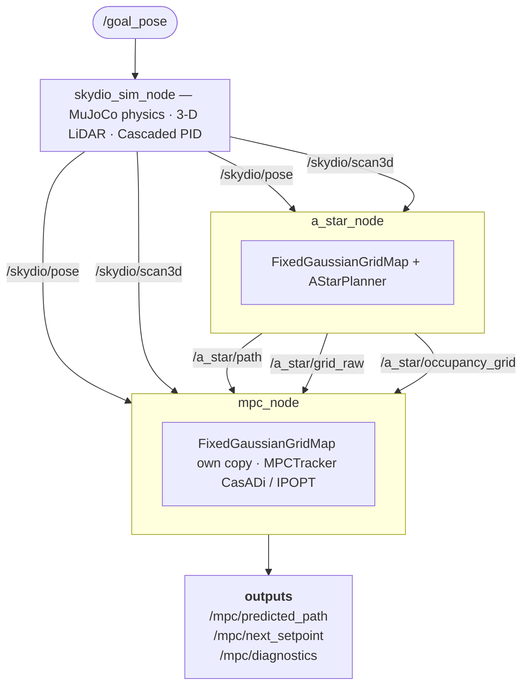

# Autonomous Navigation Stack

A complete local planning and trajectory tracking stack for the Skydio X2 quadrotor simulated in MuJoCo, exposed via ROS2.
The stack combines a real-time **Gaussian occupancy grid**, a **rolling-horizon A\* path planner**, and a **3-D CasADi/IPOPT MPC tracker** that drives the drone's built-in cascaded PID controller toward a global goal while avoiding obstacles detected by a 3-D LiDAR.

---

## Table of Contents

1. [System Architecture](#1-system-architecture)
2. [Node Graph](#2-node-graph)
3. [Mathematical and Modeling Formulation](#3-mathematical-and-modeling-formulation)
   - 3.1 [Fixed Gaussian Grid Map](#31-fixed-gaussian-grid-map)
   - 3.2 [Rolling-Horizon A\* Planner](#32-rolling-horizon-a-planner)
   - 3.3 [3-D MPC Trajectory Tracker](#33-3-d-mpc-trajectory-tracker)
4. [Package Layout](#4-package-layout)
5. [Parameters Reference](#5-parameters-reference)
6. [How to Build](#6-how-to-build)
7. [How to Run](#7-how-to-run)
   - 7.1 [Simulation only](#71-simulation-only)
   - 7.2 [With Foxglove Studio](#72-with-foxglove-studio)
8. [Foxglove Visualisation Guide](#8-foxglove-visualisation-guide)
9. [Results — GIF Recordings and Plots](#9-results--gif-recordings-and-plots)

---

## 1. System Architecture




**Data flow summary**

| Step | What happens |
|------|-------------|
| 1 | `skydio_sim_node` steps MuJoCo, publishes `/skydio/pose` and `/skydio/scan3d` at 100 Hz |
| 2 | `a_star_node` subscribes to both, rebuilds the Gaussian grid at `replan_rate_hz` (default 5 Hz), runs A*, publishes the local path on `/a_star/path` |
| 3 | `mpc_node` subscribes to the pose, scan, and the A\* path; builds its own grid; solves a 3-D IPOPT NLP at `mpc_rate_hz` (default 20 Hz); extracts a lookahead setpoint and publishes it on `/goal_pose` |
| 4 | `skydio_sim_node` receives `/goal_pose` and passes it to its cascaded PID, which commands motor thrusts inside MuJoCo |

---

## 2. Node Graph

### `skydio_sim_node`

| Direction | Topic | Message type | Description |
|-----------|-------|-------------|-------------|
| pub | `/skydio/pose` | `PoseStamped` | Drone pose in world frame at 100 Hz |
| pub | `/skydio/scan3d` | `PointCloud2` | 576-ray 3-D lidar hits (world frame) |
| pub | `/skydio/imu` | `Imu` | IMU body-frame data |
| pub | `/skydio/reference_pose` | `PoseStamped` | Current active reference pose |
| sub | `/goal_pose` | `PoseStamped` | Runtime reference override from MPC |

### `a_star_node`

| Direction | Topic | Message type | Description |
|-----------|-------|-------------|-------------|
| sub | `/skydio/pose` | `PoseStamped` | Drone position |
| sub | `/skydio/scan3d` | `PointCloud2` | Lidar hits (range-filtered) |
| sub | `/global_goal` | `PoseStamped` | Runtime global goal override |
| pub | `/a_star/path` | `Path` | Local A\* waypoints in world frame |
| pub | `/a_star/local_goal` | `PoseStamped` | Last waypoint of current A\* segment |
| pub | `/a_star/occupancy_grid` | `OccupancyGrid` | Gaussian grid as int8 [0,100] for Foxglove |
| pub | `/a_star/grid_raw` | `Float32MultiArray` | Raw float grid + metadata for MPC |
| tf | `world → drone_base_link` | `TransformStamped` | Re-broadcast of `/skydio/pose` |

### `mpc_node`

| Direction | Topic | Message type | Description |
|-----------|-------|-------------|-------------|
| sub | `/skydio/pose` | `PoseStamped` | Drone pose (position + orientation) |
| sub | `/skydio/scan3d` | `PointCloud2` | Lidar hits for MPC's own grid |
| sub | `/a_star/path` | `Path` | Local A\* path to track |
| pub | `/mpc/predicted_path` | `Path` | N-step predicted trajectory |
| pub | `/mpc/next_setpoint` | `PoseStamped` | Lookahead setpoint on predicted traj |
| pub | `/goal_pose` | `PoseStamped` | Drives the cascaded PID (same as setpoint) |
| pub | `/mpc/diagnostics` | `Float64MultiArray` | `[success, cost, solve_ms, avg_ms, fails]` |

---

## 3. Mathematical and Modeling Formulation

### 3.1 Fixed Gaussian Grid Map

**Implemented in:** [`new_mujoco/gaussian_grid_map.py`](new_mujoco/gaussian_grid_map.py)

#### Concept

The map is a square 2-D grid of fixed spatial extent $2W \times 2W$ metres that translates rigidly with the drone centre of mass.  It is rebuilt from scratch on every planning cycle — there is no map accumulation across timesteps.

#### Grid layout

Given parameters $W$ (half-width) and $r$ (resolution):

$$N_c = \left\lfloor \frac{2W}{r} \right\rceil \quad \text{(cells per axis, rounded)}$$

The grid origin (bottom-left corner in world coordinates) is:

$$\mathbf{p}_{\min} = \begin{pmatrix} p^x_{\text{drone}} - W \\ p^y_{\text{drone}} - W \end{pmatrix}$$

Cell $(i_x, i_y)$ has its centre at:

$$\mathbf{c}_{i_x, i_y} = \mathbf{p}_{\min} + \begin{pmatrix} i_x \cdot r \\ i_y \cdot r \end{pmatrix}, \quad i_x, i_y \in [0, N_c)$$

#### Occupancy probability

Let $\mathcal{O} = \{(o_x^k, o_y^k)\}_{k=1}^{M}$ be the set of lidar obstacle points projected onto the 2-D horizontal plane and lying inside the grid window.  For each cell centre $\mathbf{c}$, the minimum Euclidean distance to any obstacle point is:

$$d_{\min}(\mathbf{c}) = \min_{k} \left\| \mathbf{c} - (o_x^k, o_y^k)^T \right\|_2$$

The occupancy probability is modelled as the complementary Gaussian CDF:

$$P(\mathbf{c}) = 1 - \Phi\!\left(\frac{d_{\min}(\mathbf{c})}{\sigma}\right)$$

where $\Phi(\cdot)$ is the standard normal CDF and $\sigma$ is the Gaussian spread parameter (default $\sigma = 0.7$ m).  This gives:

- $P = 0.5$ exactly at the obstacle surface (distance = 0)
- $P \approx 0.16$ at distance $\sigma$
- $P \to 0$ far from obstacles

The computation is **fully vectorised**: a $(N_c, N_c, M)$ distance tensor is constructed by broadcasting and reduced along the obstacle axis before applying the CDF.

#### Memory estimate

For $W = 5$ m, $r = 0.25$ m ($N_c = 40$) with $M = 400$ points:

$$\text{peak memory} \approx 40 \times 40 \times 400 \times 8 \text{ bytes} \approx 5 \text{ MB}$$

---

### 3.2 Rolling-Horizon A\* Planner

**Implemented in:** [`new_mujoco/a_star_planner.py`](new_mujoco/a_star_planner.py)
**ROS2 node:** [`new_mujoco/a_star_node.py`](new_mujoco/a_star_node.py)

#### Local goal selection (rolling horizon)

The planner operates on the current fixed-extent grid (centred on the drone).  The **global goal** $\mathbf{g} = (g_x, g_y)$ may lie far outside the grid.

**Case 1 — goal inside grid:** map $\mathbf{g}$ to grid indices $(g_{ix}, g_{iy})$ directly and use as A\* target. If that cell is occupied, the nearest free cell found by BFS is used instead.

**Case 2 — goal outside grid:** intersect the ray from drone to global goal with the grid boundary using parametric clipping.

Let the drone be at $(s_{ix}, s_{iy})$ in grid indices, and let $(g_{ix}^{\text{oob}}, g_{iy}^{\text{oob}})$ be the (possibly out-of-bounds) index of the global goal.  The direction vector is:

$$\Delta = (g_{ix}^{\text{oob}} - s_{ix},\; g_{iy}^{\text{oob}} - s_{iy})$$

Find the largest $t \in [0, 1]$ such that the point $\mathbf{s} + t\,\Delta$ is still inside $[0, N_c)^2$:

$$t_x = \begin{cases} \frac{N_c - 1 - s_{ix}}{\Delta_x} & \Delta_x > 0 \\ \frac{-s_{ix}}{\Delta_x} & \Delta_x < 0 \\ 1 & \Delta_x = 0 \end{cases}, \qquad t_y = \text{analogous}$$

$$t^* = 0.97 \times \min(t_x, t_y)$$

The local A\* target (boundary cell) is:

$$b_{ix} = \text{clip}\!\left(\lfloor s_{ix} + t^* \Delta_x \rfloor,\; 0,\; N_c-1\right), \quad b_{iy} = \text{clip}\!\left(\lfloor s_{iy} + t^* \Delta_y \rfloor,\; 0,\; N_c-1\right)$$

The factor $0.97$ pulls the boundary point slightly inward to guarantee it lies within the grid.  The drone advances grid-by-grid (each grid covering $2W$ metres) until the global goal enters the grid.

#### A\* cost function

The graph is 8-connected.  The traversal cost of expanding from cell $\mathbf{n}$ to neighbour $\mathbf{n}'$ is:

$$g(\mathbf{n} \to \mathbf{n}') = \ell_{\text{move}} \cdot r \cdot c(\mathbf{n}')$$

where $\ell_{\text{move}} = 1$ (cardinal) or $\sqrt{2}$ (diagonal), $r$ is the cell resolution, and the cell cost multiplier is:

$$c(i_x, i_y) = 1 + w_{\text{obs}} \cdot P(i_x, i_y)$$

with obstacle weight $w_{\text{obs}}$ (default 15.0).  Cells with $P \geq \tau_{\text{obs}}$ (default 0.1) are treated as hard obstacles and are never expanded.

#### Heuristic

The admissible Euclidean heuristic:

$$h(\mathbf{n}, \mathbf{g}) = \sqrt{(g_{ix} - i_x)^2 + (g_{iy} - i_y)^2}$$

This is admissible (never overestimates) because diagonal moves cost $\sqrt{2}$ per cell.

#### Algorithm complexity

Standard A\* in the worst case visits $O(N_c^2)$ cells.  For $N_c = 40$ this is 1600 cells, making each replanning cycle fast enough for 5 Hz operation.

---

### 3.3 3-D MPC Trajectory Tracker

**Implemented in:** [`new_mujoco/mpc_tracker.py`](new_mujoco/mpc_tracker.py)
**ROS2 node:** [`new_mujoco/mpc_node.py`](new_mujoco/mpc_node.py)

#### State and control

The MPC uses a **3-D double-integrator with yaw** model:

$$\mathbf{x} = [p_x,\; p_y,\; p_z,\; v_x,\; v_y,\; v_z,\; \psi]^T \in \mathbb{R}^7$$

$$\mathbf{u} = [a_x,\; a_y,\; a_z,\; \dot\psi]^T \in \mathbb{R}^4$$

#### Discrete-time dynamics (forward Euler, step $\Delta t$)

$$\begin{aligned}
p_x^{k+1} &= p_x^k + v_x^k \Delta t + \tfrac{1}{2} a_x^k \Delta t^2 \\
p_y^{k+1} &= p_y^k + v_y^k \Delta t + \tfrac{1}{2} a_y^k \Delta t^2 \\
p_z^{k+1} &= p_z^k + v_z^k \Delta t + \tfrac{1}{2} a_z^k \Delta t^2 \\
v_x^{k+1} &= v_x^k + a_x^k \Delta t \\
v_y^{k+1} &= v_y^k + a_y^k \Delta t \\
v_z^{k+1} &= v_z^k + a_z^k \Delta t \\
\psi^{k+1} &= \psi^k + \dot\psi^k \Delta t
\end{aligned}$$

Default: $N = 30$ steps, $\Delta t = 0.1$ s $\Rightarrow$ 3-second prediction horizon.

#### Reference trajectory generation

The reference is built by advancing along the A\* path at the desired cruise speed $v_{\text{ref}}$.

1. Compute arc-length parameterisation of the A\* waypoints along the horizontal plane:

$$s_0 = 0, \quad s_j = s_{j-1} + \left\|(x_j, y_j) - (x_{j-1}, y_{j-1})\right\|_2$$

2. Find the closest waypoint to the current drone position: $i^* = \arg\min_j \|(p_x, p_y) - (x_j, y_j)\|$

3. For each prediction step $k = 0, \ldots, N$:

$$s_k = \min\!\left(s_{i^*} + v_{\text{ref}} \cdot k \cdot \Delta t,\; s_{\text{total}}\right)$$

Interpolate linearly along the path to obtain $\mathbf{x}_{\text{ref}}^k = (x_k^{\text{ref}}, y_k^{\text{ref}}, z_k^{\text{ref}}, \hat{v}_x, \hat{v}_y, 0, \psi_k^{\text{ref}})$ where $(\hat{v}_x, \hat{v}_y)$ is the unit tangent direction scaled by $v_{\text{ref}}$.

#### Optimisation problem

$$\min_{\mathbf{X}, \mathbf{U}} \; J(\mathbf{X}, \mathbf{U})$$

subject to dynamics, initial condition, and box constraints, where:

$$J = \sum_{k=0}^{N-1} \left[ \underbrace{(\mathbf{x}^k - \mathbf{x}_{\text{ref}}^k)^T Q (\mathbf{x}^k - \mathbf{x}_{\text{ref}}^k)}_{\text{tracking}} + \underbrace{(\mathbf{u}^k)^T R\, \mathbf{u}^k}_{\text{effort}} + \underbrace{\Delta\mathbf{u}^T \mathbf{I}\, r_{\text{jerk}} \Delta\mathbf{u}}_{\text{smoothness}} + \underbrace{w_{\text{obs}}\; f_{\text{grid}}(p_x^k, p_y^k)}_{\text{grid penalty}} + \underbrace{J_{\text{hs}}^k}_{\text{half-space}} \right] + (\mathbf{x}^N - \mathbf{x}_{\text{ref}}^N)^T Q_T (\mathbf{x}^N - \mathbf{x}_{\text{ref}}^N)$$

**Weight matrices:**

$$Q = \mathrm{diag}(Q_{xy}, Q_{xy}, Q_z, Q_{v_{xy}}, Q_{v_{xy}}, Q_{v_z}, Q_\psi)$$

$$Q_T = Q_{\text{terminal}} \cdot Q$$

$$R = \mathrm{diag}(R_{a_{xy}}, R_{a_{xy}}, R_{a_z}, R_{\dot\psi})$$

#### Soft obstacle costs

**Gaussian grid penalty** — the occupancy grid is converted to a CasADi bspline interpolant $f_{\text{grid}} : \mathbb{R}^2 \to [0, 1]$ and added as a soft cost at each predicted position:

$$J_{\text{grid}}^k = w_{\text{obs}} \cdot f_{\text{grid}}(p_x^k, p_y^k)$$

**Half-space penalty (LiDAR points)** — for each selected raw LiDAR obstacle point $\mathbf{o}_i = (o_x^i, o_y^i)$ within radius $r_{\text{check}}$ of the drone:

1. Compute outward unit normal (pointing away from obstacle, toward drone):

$$\mathbf{n}_i = \frac{(p_x^0 - o_x^i,\; p_y^0 - o_y^i)}{\left\|(p_x^0 - o_x^i,\; p_y^0 - o_y^i)\right\|_2}$$

2. Signed distance of predicted step $k$ from the obstacle along $\mathbf{n}_i$:

$$d_i^k = n_x^i (p_x^k - o_x^i) + n_y^i (p_y^k - o_y^i)$$

3. Quadratic soft penalty activated when $d_i^k < d_{\text{safe}}$:

$$J_{\text{hs}}^k = w_{\text{obs,pts}} \sum_{i=1}^{K} \max\!\left(0,\; d_{\text{safe}} - d_i^k\right)^2$$

The normals $\mathbf{n}_i$ are precomputed numerically from the current drone position; only $p_x^k, p_y^k$ are CasADi symbolic variables, keeping the NLP structure sparse.  Up to $K_{\max}$ points (default 15) sorted nearest-first are used per solve.

#### Box constraints

| Quantity | Bound |
|----------|-------|
| $\|a_{xy}\|_\infty$ | $\leq a_{\max,xy}$ |
| $\|a_z\|$ | $\leq a_{\max,z}$ |
| $\|\dot\psi\|$ | $\leq \dot\psi_{\max}$ |
| $v_x^2 + v_y^2$ | $\leq v_{\max,xy}^2$ |
| $\|v_z\|$ | $\leq v_{\max,z}$ |

#### Solver

The NLP is solved by IPOPT (Interior Point OPTimizer) via the CasADi `Opti` stack.  Warm-starting is enabled: the solution from the previous cycle is shifted by one step and used as the initial guess.

#### Lookahead setpoint extraction

After solving, the MPC node walks the predicted trajectory $\mathbf{x}^{0:N}$ and selects the **first state** at horizontal distance $\geq d_{\text{lookahead}}$ from the current drone position as the PID setpoint.  This prevents the high-frequency cascaded PID from oscillating around the 1-step-ahead point (which is only $v_{\text{ref}} \cdot \Delta t \approx 0.1$ m away).

When the entire horizon lies within $d_{\text{lookahead}}$ (drone near the local/global goal), the last A\* waypoint is used as the setpoint so the drone homes precisely onto the goal.

$$\mathbf{p}_{\text{setpoint}} = \begin{cases} \mathbf{x}^{k^*}_{[0:3]} & \text{if } \exists\, k^* : \|(p_x^{k^*}, p_y^{k^*}) - (p_x^0, p_y^0)\| \geq d_{\text{lookahead}} \\ \text{last A* waypoint} & \text{otherwise (near goal)} \end{cases}$$

---

## 4. Package Layout

```
new_mujoco/
├── config/
│   └── skydio_params.yaml          # all tunable parameters
├── launch/
│   └── skydio_sim.launch.py        # single launch file for all 3 nodes
├── new_mujoco/
│   ├── __init__.py
│   ├── skydio_sim_node.py          # MuJoCo sim + cascaded PID
│   ├── gaussian_grid_map.py        # FixedGaussianGridMap
│   ├── a_star_planner.py           # AStarPlanner
│   ├── a_star_node.py              # ROS2 node wrapping the planner
│   ├── mpc_tracker.py              # MPCTracker (CasADi / IPOPT)
│   └── mpc_node.py                 # ROS2 node wrapping the MPC
├── setup.py
├── package.xml
└── README.md                       # this file
```

---

## 5. Parameters Reference

All parameters live in [`config/skydio_params.yaml`](config/skydio_params.yaml) under the `/**:ros__parameters:` namespace (applies to every node in the launch file).

### Simulation (`skydio_sim_node`)

| Parameter | Default | Unit | Description |
|-----------|---------|------|-------------|
| `model_path` | (absolute) | — | Path to MuJoCo `.xml` scene |
| `ref_x/y/z` | 20.0 / 1.0 / 1.5 | m | Initial reference position |
| `ref_yaw` | 0.0 | rad | Initial reference heading |
| `publish_rate_hz` | 100.0 | Hz | Pose / scan / IMU publish rate |
| `max_speed_xy/z` | 1.5 / 0.6 | m/s | Kinematic limits |
| `wind_x/y/z` | 0.0 | m/s | Constant mean wind |
| `wind_turbulence_std` | 0.3 | m/s | Ornstein-Uhlenbeck gust 1-sigma |
| `wind_turbulence_tau` | 2.0 | s | Gust correlation time |
| `drag_coeff` | 0.25 | kg/m | Quadratic aerodynamic drag |
| `hover_thrust` | 3.2496 | N | Per-motor hover feed-forward |
| `pos_kp/ki/kd` | 0.6 / 0.0 / 0.15 | — | Position PID gains |
| `alt_kp/ki/kd` | 2.0 / 0.15 / 0.8 | — | Altitude PID gains |
| `vel_kp/ki/kd` | 0.06 / 0.001 / 0.01 | — | Velocity → angle PID gains |
| `roll/pitch_kp/ki/kd` | 2.5 / 0.5 / 1.2 | — | Roll / pitch PID gains |
| `yaw_kp/ki/kd` | 0.5 / 0.0 / 5.0 | — | Yaw PID gains |

### A\* planner (`a_star_node`)

| Parameter | Default | Unit | Description |
|-----------|---------|------|-------------|
| `goal_x/y/z` | 20.0 / 1.0 / 1.5 | m | Global goal (overridable at runtime) |
| `grid_reso` | 0.25 | m | Grid cell size |
| `grid_half_width` | 5.0 | m | Grid half-extent ($W$) |
| `grid_std` | 0.7 | m | Gaussian spread $\sigma$ |
| `obstacle_threshold` | 0.1 | — | Hard-obstacle probability cutoff $\tau$ |
| `obstacle_cost_weight` | 15.0 | — | Soft cost multiplier $w_{\text{obs}}$ |
| `replan_rate_hz` | 5.0 | Hz | Replanning frequency |
| `goal_reached_radius` | 0.3 | m | Stop replanning within this radius |
| `max_lidar_range` | 6.0 | m | Range filter applied to LiDAR before grid |
| `planning_height` | 1.5 | m | Fixed $z$ assigned to 2-D A\* waypoints |

### MPC tracker (`mpc_node`)

| Parameter | Default | Unit | Description |
|-----------|---------|------|-------------|
| `mpc_N` | 30 | — | Prediction horizon steps |
| `mpc_dt` | 0.1 | s | Discretisation step |
| `mpc_v_max_xy` | 2.0 | m/s | Max horizontal speed |
| `mpc_v_max_z` | 1.0 | m/s | Max vertical speed |
| `mpc_a_max_xy` | 2.0 | m/s² | Max horizontal acceleration |
| `mpc_a_max_z` | 1.5 | m/s² | Max vertical acceleration |
| `mpc_yaw_rate_max` | 1.5 | rad/s | Max yaw rate |
| `mpc_v_ref` | 1.0 | m/s | Desired cruise speed |
| `mpc_Q_xy` | 30.0 | — | Horizontal position tracking weight |
| `mpc_Q_z` | 20.0 | — | Altitude tracking weight |
| `mpc_Q_vel_xy` | 10.0 | — | Horizontal velocity tracking weight |
| `mpc_Q_vel_z` | 2.0 | — | Vertical velocity tracking weight |
| `mpc_Q_yaw` | 0.2 | — | Yaw tracking weight |
| `mpc_Q_terminal` | 50.0 | — | Terminal cost multiplier |
| `mpc_R_acc_xy` | 1.0 | — | Horizontal acceleration effort weight |
| `mpc_R_acc_z` | 1.5 | — | Vertical acceleration effort weight |
| `mpc_R_yaw_rate` | 0.1 | — | Yaw-rate effort weight |
| `mpc_R_jerk` | 0.3 | — | Delta-u smoothness weight |
| `mpc_W_obs` | 100.0 | — | Gaussian grid soft penalty weight |
| `mpc_d_safe_pts` | 0.5 | m | Safety clearance from each LiDAR point |
| `mpc_W_obs_pts` | 50.0 | — | Half-space penalty weight |
| `mpc_max_obs_constraints` | 15 | — | Max LiDAR points used per solve |
| `mpc_obs_check_radius` | 3.0 | m | Radius for selecting obstacle points |
| `mpc_max_iter` | 100 | — | Max IPOPT iterations |
| `mpc_warm_start` | true | — | Reuse previous solution as warm start |
| `mpc_rate_hz` | 20.0 | Hz | MPC solve rate |
| `mpc_lookahead_dist` | 1.5 | m | Minimum setpoint distance from drone |

---

## 6. How to Build

### Prerequisites

```bash
# ROS2 Humble (or later)
# Python packages
pip install casadi scipy numpy

# MuJoCo Python bindings
pip install mujoco
```

### Build

```bash
cd ~/Drone-optimal-trajectory/mujoco/ros2_ws

# First build (from scratch)
colcon build --packages-select new_mujoco

# Incremental rebuild after code changes
colcon build --packages-select new_mujoco --symlink-install

# Source the workspace
source install/setup.bash
```

---

## 7. How to Run

### 7.1 Simulation only

```bash
# Terminal 1 — source and launch all three nodes
source ~/Drone-optimal-trajectory/mujoco/ros2_ws/install/setup.bash
ros2 launch new_mujoco skydio_sim.launch.py

# Optional: override goal position at launch time
ros2 launch new_mujoco skydio_sim.launch.py ref_x:=15.0 ref_z:=2.0
```

The MuJoCo passive viewer will open automatically.  All three nodes start simultaneously:
- `skydio_sim` — physics simulation + sensor publishing
- `a_star_node` — local path planning
- `mpc_node` — trajectory tracking + setpoint publishing

**Override the global goal at runtime** (while the simulation is running):

```bash
ros2 topic pub --once /global_goal geometry_msgs/PoseStamped \
  "{header: {frame_id: 'world'}, pose: {position: {x: 25.0, y: 5.0, z: 2.0}}}"
```

**Monitor diagnostics:**

```bash
# MPC solve statistics [success, cost, solve_ms, avg_ms, fail_count]
ros2 topic echo /mpc/diagnostics

# A* path length
ros2 topic echo /a_star/path --field poses --once | python3 -c "import sys, json; d=json.load(sys.stdin); print(len(d))"
```

### 7.2 With Foxglove Studio

Foxglove Studio provides real-time 3-D visualisation of the drone, lidar, occupancy grid, and all paths.

**Step 1 — Install the Foxglove bridge**

```bash
sudo apt install ros-humble-foxglove-bridge
# or
pip install foxglove-bridge
```

**Step 2 — Launch the simulation with the bridge**

```bash
# Terminal 1 — simulation
source ~/Drone-optimal-trajectory/mujoco/ros2_ws/install/setup.bash
ros2 launch new_mujoco skydio_sim.launch.py

# Terminal 2 — Foxglove WebSocket bridge
source /opt/ros/humble/setup.bash
ros2 run foxglove_bridge foxglove_bridge \
    --ros-args -p port:=8765 -p send_buffer_limit:=10000000
```

**Step 3 — Connect Foxglove Studio**

1. Open [Foxglove Studio](https://studio.foxglove.dev) (web or desktop app)
2. Click **Open connection** → **Foxglove WebSocket** → `ws://localhost:8765`
3. Import the panel layout described in the next section

---

## 8. Foxglove Visualisation Guide

### Recommended panel layout

| Panel | Topic(s) | Notes |
|-------|---------|-------|
| **3D** | `/skydio/scan3d` (PointCloud2), `/a_star/path` (Path), `/mpc/predicted_path` (Path), `/skydio/pose` (PoseStamped), `/a_star/local_goal` | Main spatial view |
| **Map** | `/a_star/occupancy_grid` (OccupancyGrid) | 2-D Gaussian grid, updates at 5 Hz |
| **Plot** | `/mpc/diagnostics` fields 0–4 | Live solve time, cost, fail count |
| **Raw Messages** | `/mpc/next_setpoint` | Current PID setpoint |

### 3D panel: suggested topic settings

| Topic | Render as | Color / Notes |
|-------|-----------|---------------|
| `/skydio/scan3d` | Point cloud | Orange, point size 3 px |
| `/a_star/path` | Line strip | Blue, line width 3 px |
| `/mpc/predicted_path` | Line strip | Green, line width 2 px |
| `/skydio/pose` | Axis / arrow | Frame: `world` |
| `/a_star/local_goal` | Sphere | Cyan |
| `/mpc/next_setpoint` | Sphere | Red — active PID target |

### TF tree

`a_star_node` broadcasts the TF `world → drone_base_link` by re-publishing `/skydio/pose`.  Enable **TF** display in the 3D panel to see the drone coordinate frame.

### OccupancyGrid interpretation

The `/a_star/occupancy_grid` topic carries int8 values in `[0, 100]` where:
- `0` = fully free (probability 0)
- `100` = fully occupied (probability 1.0)
- Grid origin is at `msg.info.origin.position.{x,y}` (drone-centred, updates every replan cycle)

---

## 9. Results — GIF Recordings and Plots

> **Instructions for contributors:** Place result assets in the `docs/results/` folder and link them below.
> Recommended naming convention:
> - `docs/results/nav_<scenario>_<date>.gif` — screen-captured GIF of Foxglove 3D panel
> - `docs/results/plot_<metric>_<date>.png` — static plots (trajectory, cost, solve time)

### 9.1 Navigation demonstration

<!-- Replace the placeholder below with actual GIF once recorded -->

```
docs/results/nav_obstacle_course_YYYY-MM-DD.gif
```

Suggested recording procedure (Linux):

```bash
# 1. Install peek or kazam for screen capture
sudo apt install peek

# 2. Start the simulation + bridge (see Section 7.2)

# 3. Open Foxglove, arrange panels, then start recording with peek
#    Focus on the 3D panel showing the drone, lidar, A* path, and MPC trajectory

# 4. Save as GIF or convert MP4 -> GIF:
ffmpeg -i recording.mp4 -vf "fps=15,scale=960:-1:flags=lanczos" \
       -c:v gif docs/results/nav_obstacle_course_YYYY-MM-DD.gif
```

### 9.2 Trajectory and path plots

Suggested plots to generate from a rosbag recording:

```bash
# Record a bag
ros2 bag record /skydio/pose /a_star/path /mpc/predicted_path \
                /mpc/diagnostics /a_star/occupancy_grid \
                -o docs/results/bags/run_YYYY-MM-DD
```

**Plot 1 — XY ground track**

Compare the A\* local path (blue), MPC predicted path (green), and actual drone trajectory (red) in the world XY plane, overlaid on the Gaussian occupancy grid (greyscale heatmap).

**Plot 2 — Altitude profile**

Plot $p_z(t)$, $z_{\text{ref}}(t)$, and the MPC-predicted altitude band over time.

**Plot 3 — MPC solve statistics**

From `/mpc/diagnostics`:
- Solve time per cycle (ms) — target $< 50$ ms at 20 Hz
- Running average solve time
- Cumulative failure count

**Plot 4 — Obstacle avoidance clearance**

Minimum distance from the drone trajectory to any lidar point over time. Should remain $> d_{\text{safe}}$ (default 0.5 m) once the MPC half-space penalty is active.

### 9.3 Placeholder: results table

| Scenario | Global goal | Obstacles | Avg solve time | Path length | Success |
|----------|------------|-----------|---------------|-------------|---------|
| Open field | (20, 1, 1.5) | None | — ms | — m | — |
| Single pillar | (20, 1, 1.5) | 1 column | — ms | — m | — |
| Maze corridor | (20, 0, 1.5) | Multiple walls | — ms | — m | — |

> Fill in the table after running experiments and recording rosbags.
